# Alfred 数据模型 V2（V1 重新设计定稿）

> **这是 V1 重新设计的权威数据模型。** 旧 `DATA_MODEL.md` 已过时，仅供对照。
> 决策背景与逐条论证见 [design-sessions/2026-08-03-v1-redesign.md](./design-sessions/2026-08-03-v1-redesign.md)；每个决策有对应 ADR（0009–0017）。
> 数据库：PostgreSQL 16 ｜ ORM：SQLModel ｜ 迁移：Alembic ｜ 编排：LangGraph（见 ADR-0012）。

---

## 0. 旧 → 新 重命名映射

| 旧（DATA_MODEL.md） | 新（V2） | ADR |
|---|---|---|
| `position` | `job_posting` | [0009](./adr/0009-naming-job-posting-occupation.md) |
| `position.job_family` | `occupation` | [0009](./adr/0009-naming-job-posting-occupation.md) |
| `company` | `organization` | [0017](./adr/0017-organization-generalization.md) |
| `tag.namespace = 'skill'` | `skill` 表 + `user_skill` | [0010](./adr/0010-event-fact-dual-truth.md)、[0011](./adr/0011-multi-tenant-boundary.md) |
| `event`（带 kind 的时间轴表） | `event`（行为真相）+ `interaction`/`interview` 强类型表 | [0010](./adr/0010-event-fact-dual-truth.md) |
| `coffee_chat` 概念 | `interaction`（kind 枚举，泛化） | [0010](./adr/0010-event-fact-dual-truth.md) |

### 0.1 引擎术语重构（2026-08-04，ADR-0018 / 0019）
另有一组**引擎层**重命名（非数据表）：原 "Skill" 目录改为 **Node**；多 Node 经 Edge 组成 **Graph**（Python 声明，见 ADR-0019）；Node 内部原子写原语 **Action** 不变。数据模型里的 `skill` 表不参与此次改名，仍指能力词表。

| 旧（引擎） | 新（引擎） | ADR |
|---|---|---|
| `Skill` 目录（含 prompt+output_schema+actions） | `Node`（处理单元） | [0018](./adr/0018-engine-terminology-node-graph-action.md) |
| —（Node 之间原本无真控制流） | `Graph`（LangGraph `StateGraph`，Python 声明） | [0018](./adr/0018-engine-terminology-node-graph-action.md)、[0019](./adr/0019-graph-as-python.md) |
| `ACTION_KINDS` / executor handler | `Action`（不变） | — |

---

## 1. 设计铁律（写代码前必读）

1. **双真相（ADR-0010）**：行为 → `event`（append-only 不可变）；状态 → `fact`（物化快照，`valid_from→valid_to`）。二者并列互补，经 `fact.source_event_id` 双向可追。`application`/`interview` 是强类型表，Event 只记"行为发生"。
2. **Action 唯一写入口（ADR-0012）**：LangGraph 节点落库一律走 `ActionExecutor`，保留 `dry_run/commit` 与 Fake-provider 可测。
3. **租户边界（ADR-0011）**：私有表带 `user_id`；共享实体/词表（`user`/`person`/`organization`/`occupation`/`skill`/`location`）不带。
4. **强类型优先（ADR-0010）**：可归类数据进强类型表，`memory` 仅收容残余。
5. **简历可解释（ADR-0014）**：bullet 软引用 `fact`，渲染加 footnote，校验阻断无源。
6. **内核领域无关（ADR-0016）**：内核表不带求职专有字段；新领域（健康/记账）未来平行加领域包。
7. **枚举用 varchar + StrEnum**（沿用现有约定），不用 PG 原生 enum。

---

## 2. 全景 ER（kernel 与 domain 分层）

```mermaid
erDiagram
    %% ---- 领域无关内核 ----
    USER ||--o{ CHAT_THREAD : "拥有"
    CHAT_THREAD ||--o{ CHAT_SEGMENT : "分段"
    CHAT_THREAD ||--o{ CHAT_MESSAGE : "含"
    CHAT_MESSAGE ||--o{ ATTACHMENT : "含(方向化)"
    CHAT_MESSAGE ||--o{ EVENT : "触发行为"
    EVENT ||--o| FACT : "物化为状态"
    PERSON }o--o{ ORGANIZATION : "任职于"
    ORGANIZATION ||--o{ JOB_POSTING : "发布"
    OCCUPATION ||--o{ JOB_POSTING : "属于"
    LOCATION ||--o{ JOB_POSTING : "位于"
    LOCATION ||--o{ LOCATION_ALIAS : "别名"
    SKILL ||--o{ SKILL_ALIAS : "别名"
    USER ||--o{ FACT : "私有状态"
    USER ||--o{ EVENT : "私有行为"
    USER ||--o{ MEMORY : "私有记忆"
    USER ||--o{ REMINDER : "手设提醒"
    USER ||--o{ NUDGE : "系统提醒"

    %% ---- 求职领域包 ----
    USER ||--o{ APPLICATION : "私有投递"
    USER ||--o{ USER_SKILL : "我的技能"
    USER ||--o{ EXPERIENCE : "我的经历"
    OCCUPATION }o--o{ USER_SKILL : "跨用户可比"
    SKILL ||--o{ USER_SKILL : "技能定义"
    SKILL ||--o{ POSITION_REQUIREMENT : "JD所需"
    JOB_POSTING ||--o{ APPLICATION : "投递"
    JOB_POSTING ||--o{ POSITION_REQUIREMENT : "要求"
    APPLICATION ||--o{ INTERVIEW : "轮次"
    APPLICATION }o--o| DOCUMENT_VERSION : "所用CV"
    APPLICATION }o--o| DOCUMENT_VERSION : "所用CL"
    EXPERIENCE ||--o{ EXPERIENCE_SOURCE : "来源"
    DOCUMENT_ASSET ||--o{ DOCUMENT_VERSION : "版本链"
    DOCUMENT_VERSION ||--o{ DOCUMENT_VERSION_EXPERIENCE : "引用经历"
    DOCUMENT_VERSION ||--o{ DOCUMENT_VERSION_FACT : "溯源fact"
    FACT ||--o{ DOCUMENT_VERSION_FACT : "被引用"
    PERSON ||--o{ INTERVIEW_INTERVIEWER : "面试官"
    INTERVIEW ||--o{ INTERVIEW_INTERVIEWER : ""
    PERSON ||--o{ INTERACTION_PERSON : "参与"
    INTERACTION ||--o{ INTERACTION_PERSON : "多人"

    %% ---- 习惯领域包（ADR-0021） ----
    USER ||--o{ HABIT : "定义"
    HABIT ||--o{ HABIT_LOG : "打卡"
    LOCATION ||--o{ HABIT_LOG : "场所"

    %% ---- 作品领域包（ADR-0021） ----
    USER ||--o{ WORK_ITEM : "记录"
    WORK_ITEM ||--o{ REVIEW : "观后感/读后感"
    LOCATION ||--o{ WORK_ITEM : "地点"

    %% ---- 进度/旅行领域包（ADR-0021） ----
    USER ||--o{ PROJECT : "管理(kind)"
    PROJECT ||--o{ PROJECT : "父子"
    PROJECT ||--o{ PROGRESS_LOG : "日志"
    PROJECT ||--o{ TRIP_DAY : "按天"
    LOCATION ||--o{ TRIP_DAY : "足迹"
```

---

## 3. 内核表（领域无关，V3 管家直接复用）

### 3.1 `event` — 行为真相（append-only）
| 列 | 类型 | 说明 |
|---|---|---|
| `id` | uuid PK | |
| `type` | varchar | `FACT_DECLARED`\|`APPLICATION_SUBMITTED`\|`INTERACTION_HAPPENED`\|`SKILL_EXTRACTED`\|`INTERVIEW_SCHEDULED`\|`RESUME_GENERATED`\|`CUSTOM` |
| `actor_user_id` | uuid | **私有**（行为主体） |
| `occurred_at` | timestamptz | |
| `source_type` | varchar | `conversation`\|`import`\|`api` |
| `source_ref_id` | uuid | 指向 chat_message / import 等 |
| `payload` | jsonb | 指向本次创建的实体 `{fact_id?, person_id?, application_id?, ...}` |

**不可变**：写入后不更新、不软删。

### 3.2 `fact` — 状态真相（物化快照）
| 列 | 类型 | 说明 |
|---|---|---|
| `id` | uuid PK | |
| `kind` | varchar | `skill_declaration`\|`relationship`\|`attribute`\|`custom` |
| `valid_from` | timestamptz | |
| `valid_to` | timestamptz NULL | 纠错时封口旧值 |
| `subject_ref` / `object_ref` | uuid | 指向 person/skill/organization |
| `proficiency` | varchar NULL | 技能类 Fact 的量表（定义在 fact 内） |
| `source_event_id` | uuid FK → event | 双向追溯 |
| `source_conversation_id` | uuid FK → chat_message | |
| `owner_user_id` | uuid | **私有** |

### 3.3 `person` / `organization` / `occupation` / `skill` / `skill_alias` / `location` / `location_alias`
- `person`：保持 slug 唯一标识（"每一个人都要有 unique identifier"）。
- `organization`（原 `company`）：加 `kind` 枚举（company/school/club/ngo/government/fund/open_source_office/other）。**共享表**。
- `occupation`：职位大类，跨公司可比。**共享表**。
- `skill`：**共享词表**（"Excel" 全库只定义一次）；`skill_alias` 反查合并。
- `location` + `location_alias`：结构化地点 + 别名（香港/HK/Hong Kong → 同行）。**共享表**。

### 3.4 `chat_thread` / `chat_segment` / `chat_message`
- `chat_thread`：每用户一个常驻。
- `chat_segment`（新增）：`id, thread_id, title, started_at, ended_at, status(active|archived|merged), summary_md, user_id`。
- `chat_message`：双方全量原话 + sequence + `segment_id` 外键化；保留软丢弃。

### 3.5 `memory` / `reminder` / `nudge` / `nudge_rule`
- `memory`：残余非结构化（kind=fact/preference/intent/context）。**私有**。
- `reminder`：用户**手设**提醒。
- `nudge_rule` + `nudge`：**系统主动**生成的提醒（与 reminder 分表）。`nudge` 预留 `channel`(email/digest/miniprogram) 供未来扩展（M2 账本本轮 defer）。**私有**。

---

## 4. 求职领域包（V1 专属）

### 4.1 `job_posting`（原 `position`）
加 `occupation_id` FK、`location_id` FK（替代 `location` 字符串）、`required_documents`、`posted_at`；保留 `fingerprint`(UNIQUE)、薪资/签证/工作模式等字段。`deadline_at` 驱动提醒。

### 4.2 `position_requirement`（替代 `position.requirements` JSONB）
| 列 | 类型 | 说明 |
|---|---|---|
| `id` | uuid PK | |
| `position_id` | uuid FK | |
| `kind` | varchar | `skill`\|`qualification`\|`experience` |
| `skill_id` | uuid FK NULL → skill | |
| `text` | varchar | 要求原文（可追溯 JD 原句） |
| `importance` | varchar | `must`\|`nice` |
| `source_sentences` | jsonb | JD 原句追溯 |

### 4.3 `application` / `interview`（强类型，独立）
保持现有状态机与外键。`application` 的"投递行为"同时写一条 `event(APPLICATION_SUBMITTED)`；细节仍在 `application`。投递凭证用 `application_evidence(application_id, attachment_id, role)`（截图是凭证非普通附件）。`interview` 每轮一条。

### 4.4 `experience` / `experience_source`
一条经历一行，仅存 `raw_input_md`（口语稿）。多条语音经 `experience_source` 挂到同一条经历。AI 优化稿不存经历，按岗位存入 `document_version_experience.rendered_bullets`。

### 4.5 `user_skill`（我的技能）
`id, user_id, skill_id, proficiency(1-5)`。是 `fact` 中"技能声明"的查询投影（ADR-0010）。支撑三大匹配查询：① 哪些岗位需我的技能 X ② 我凭 X 能投哪些岗位 ③ 我的技能 vs 岗位要求匹配度（matched/gap）。

### 4.6 `document_asset` / `document_version` / `document_version_experience` / `document_version_fact`
- `document_version` 改存**结构化 Markdown 主信息** + `template_ref` + `checksum`；编译时套 `resume_asset.base_template` 生成 PDF。版本复用基于全局 checksum（不限最新版），`based_on_id` 指向用户显式选择的父版本。
- `document_version_fact`（新增）：简历 bullet → `fact` 软引用，支撑渲染 footnote + 校验阻断无源（ADR-0014）。

### 4.7 `interaction`（泛化接触记录，替代窄 `coffee_chat`）
`id, user_id, kind(coffee_chat|meal|hangout|call|networking_event|info_session|referral_talk), occurred_at, summary_md`；多人场景用 `interaction_person` 关系表。其"发生"行为写 `event(INTERACTION_HAPPENED)`。

---

## 5. 新增领域包（habit / media / progress，ADR-0021）

> 本轮（2026-08-04）在「共享基座 + 领域扩展表」路线下新增三领域，先定模型、逐步实现。job 现有表（§4）原样保留并包成第一个 Domain Graph。

### 5.1 `habit` / `habit_log`（习惯 Tracker）
- `habit`：`id, user_id, name, kind(health|sport|study|life|other), cadence(daily|weekly|custom), goal_md, created_at, archived_at`。习惯定义。
- `habit_log`：`id, user_id, habit_id, occurred_at, note_md, location_id NULL → location`。打卡记录；**可挂 `location_id`**（如「在某某球馆打乒乓球」）。

### 5.2 `work_item` / `review`（作品 / 书影音）
- `work_item`：`id, user_id, kind(book|movie|drama|game|music|other), title, creator_md, location_id NULL → location, started_at, finished_at, status(wish|doing|done), rating(1-5) NULL`。书/影/剧/游戏等；**可挂 `location_id`**（如「在某某书店读完」）。
- `review`：`id, user_id, work_item_id, rating(1-5), content_md, reviewed_at`。读后感/观后感。

### 5.3 `project` / `progress_log` / `trip_day`（进度 / 项目 / 旅行）
- `project`：`id, user_id, kind(vlog|project|trip|other), title, parent_id NULL → project（父子）, status, started_at, due_at, summary_md`。`kind='trip'` 即旅行；支持父子（大项目拆子项目）。
- `progress_log`：`id, user_id, project_id, occurred_at, note_md, progress_pct NULL`。进度日志（vlog 第几集、项目里程碑）。
- `trip_day`：`id, user_id, project_id(kind=trip), day_date, location_id → location, note_md`。旅行按天挂 `location_id`，实现「今天去哪/明天去哪」。

> **旅行归 progress**：不单独设 travel 领域；`project.kind='trip'` + `trip_day` 表达，靠共享 `location` 与 job/habit/media 的地点统一挂钩。

## 6. 关键查询模式

- **技能匹配**：`user_skill ⋈ skill ⋈ position_requirement` 三表 JOIN（均带索引）。
- **简历溯源**：渲染时经 `document_version_fact` 拼 footnote；校验器阻断 `source` 为空的 bullet。
- **统一时间轴**：`SELECT ... FROM event WHERE actor_user_id=:u ORDER BY occurred_at`（行为视角）；状态快照查 `fact WHERE owner_user_id=:u AND valid_to IS NULL`。
- **上下文组装**：`context = summary(相关 segment) + 当前 segment 近 N 轮 + 向量/BM25 召回 fact/event`（ADR-0013）。

---

## 7. 迁移影响面（实现期）

1. **重命名**：`position→job_posting`、`company→organization`、`position.job_family→occupation`、`tag.namespace='skill'→skill+user_skill`。
2. **新增表**（按依赖顺序）：`occupation` → `job_posting` → `skill` → `skill_alias` → `location` → `location_alias` → `position_requirement` → `experience` → `experience_source` → `user_skill` → `fact` → `event` → `chat_segment` → `interaction` → `interaction_person` → `application_evidence` → `document_version_fact` → `nudge_rule` → `nudge`。
3. **语义变更**：`event` 从时间轴表改为行为真相；旧 `event.kind` 内容迁移到 `interaction`/`interview` 强类型表。
4. **租户列**：所有私有表加 `user_id` + 复合唯一约束（`UNIQUE(user_id, slug)`）。
5. **每表独立 Alembic revision**，避免巨型迁移。
6. **新增领域包表**（ADR-0021，先定模型逐步实现）：`habit` → `habit_log` → `work_item` → `review` → `project` → `progress_log` → `trip_day`；其中 `habit_log` / `work_item` / `trip_day` 挂 `location_id` 复用共享 `location`。`travel` 不单设领域，`project.kind='trip'` + `trip_day` 表达。
