# Alfred 数据模型 V3（求职领域细化 · 草稿）

> **元信息**
>
> - 状态：草稿（待评审，用户会逐处修改）
> - 最后更新：2026-08-18
> - 范围：求职领域包（V1 第一个产品路径）的细化数据模型
> - 关联：[DATA_MODEL_V2](../DATA_MODEL_V2.md)、[求职助理 PRD](../prd/job-seeking.md)、[ADR-0023 图表归档位置](../adr/0023-diagram-placement.md)

> **本篇是 `DATA_MODEL_V2.md` 在求职领域的细化草稿**，不重复 V2 已定义的内核表（USER / CHAT_THREAD / EVENT / FACT / PERSON / ORGANIZATION / SKILL …），只在其之上**扩展求职领域包**，并补完工作流五～七所需的新表。V2 仍为内核权威；本篇经评审后将回流进 V2。
> 数据是所有流程的核心——本篇以 **ER 图 + 数据流（每个工作流读写哪些表）** 为主线，先定数据形状，再谈行为。

---

## 0. 与 V2 的关系 & 本篇新增点

| 主题 | V2 已有 | 本篇新增 / 变更 |
|---|---|---|
| 投递 | `application` / `application_evidence` | 新增 `application_material(application_id, document_version_id, role)` 精确记录「哪份 CV / CL / 邮件用在哪次投递」 |
| 面试 | `interview`（每轮一条） | 扩展面试复盘 / 感受 / 结果时间字段；新增 `interview_qa`、`interview_note`（面经） |
| 跟进 | — | 新增 `follow_up`（email / message，含渠道、语言、发送状态） |
| 题库 | — | 新增 `question_bank`（technical / behavior / 单面 / 群面） |
| 多语料 | `document_version` | 新增 `language`(zh/en) 与 `doc_kind`(cv/cl/email)，支撑同经历不同语言版本 |

---

## 1. 设计铁律（继承 V2，求职域补充）

1. **双真相（ADR-0010）**：行为 → `event`（append-only）；状态 → `fact`（物化快照）。`application`/`interview`/`follow_up` 是强类型表，`event` 只记「行为发生」。
2. **Action 唯一写入口（ADR-0012）**：落库一律走 `ActionExecutor`，保留 `dry_run/commit`。
3. **租户边界（ADR-0011）**：私有表带 `user_id`；共享词表（`person`/`organization`/`skill`/`occupation`/`location`）不带。
4. **版本可追溯（用户硬要求）**：CV / CL / 邮件各自「哪一份用在哪个岗位」的映射，**只在用户确认后**经 `application_material` 落库，生成时不记录。
5. **不编造**：面经 / 面试信息搜不到如实说明，绝不写库。
6. **引用消解层**：用户说「港大做 RA 那段」而非「经历 #3」，需自然语言 → filter → 检索 → Top-N 候选 → 用户确认，编号仅是本次临时列表，非持久身份。

---

## 2. 全景 ER（求职领域细化）

> 仅画求职领域包及其与内核的边界；内核表以「（V2）」标注，字段见 V2。

```mermaid
erDiagram
    %% ===== 内核（V2，仅边界） =====
    USER ||--o{ CHAT_THREAD : "常驻对话"
    CHAT_THREAD ||--o{ CHAT_MESSAGE : "含"
    CHAT_MESSAGE ||--o{ ATTACHMENT : "含(方向化)"
    CHAT_MESSAGE ||--o{ EVENT : "触发行为"
    EVENT ||--o| FACT : "物化为状态"
    USER ||--o{ MEMORY : "私有记忆"
    USER ||--o{ REMINDER : "手设提醒"
    NUDGE_RULE ||--o{ NUDGE : "生成"
    USER ||--o{ NUDGE : "系统提醒"

    PERSON }o--o{ ORGANIZATION : "任职于"
    ORGANIZATION ||--o{ JOB_POSTING : "发布"
    OCCUPATION ||--o{ JOB_POSTING : "属于"
    LOCATION ||--o{ JOB_POSTING : "位于"
    SKILL ||--o{ SKILL_ALIAS : "别名"
    SKILL ||--o{ POSITION_REQUIREMENT : "JD所需"
    JOB_POSTING ||--o{ POSITION_REQUIREMENT : "要求"
    SKILL ||--o{ USER_SKILL : "技能定义"
    USER ||--o{ USER_SKILL : "我的技能"
    OCCUPATION }o--o{ USER_SKILL : "跨用户可比"

    %% ===== 求职领域包（本篇细化） =====
    USER ||--o{ APPLICATION : "私有投递"
    JOB_POSTING ||--o{ APPLICATION : "投递"
    APPLICATION ||--o{ APPLICATION_EVIDENCE : "凭证(截图/确认邮件)"
    ATTACHMENT ||--o{ APPLICATION_EVIDENCE : "作为凭证"
    APPLICATION ||--o{ APPLICATION_MATERIAL : "所用材料"
    DOCUMENT_VERSION ||--o{ APPLICATION_MATERIAL : "CV/CL/邮件版"

    USER ||--o{ DOCUMENT_ASSET : "简历资产"
    DOCUMENT_ASSET ||--o{ DOCUMENT_VERSION : "版本链"
    DOCUMENT_VERSION ||--o{ DOCUMENT_VERSION_EXPERIENCE : "引用经历"
    EXPERIENCE ||--o{ DOCUMENT_VERSION_EXPERIENCE : "被引用"
    DOCUMENT_VERSION ||--o{ DOCUMENT_VERSION_FACT : "溯源fact"
    FACT ||--o{ DOCUMENT_VERSION_FACT : "被引用"

    APPLICATION ||--o{ INTERVIEW : "轮次(每轮一条)"
    INTERVIEW ||--o{ INTERVIEW_INTERVIEWER : "面试官"
    PERSON ||--o{ INTERVIEW_INTERVIEWER : "是谁"
    INTERVIEW ||--o{ INTERVIEW_QA : "问题/回答"
    INTERVIEW ||--o{ INTERVIEW_NOTE : "面经"
    JOB_POSTING ||--o{ INTERVIEW_NOTE : "挂钩岗位"
    USER ||--o{ INTERVIEW_NOTE : "私有"

    INTERVIEW ||--o{ FOLLOW_UP : "跟进"
    APPLICATION ||--o{ FOLLOW_UP : "关联投递"
    USER ||--o{ FOLLOW_UP : "私有"
    FOLLOW_UP }o--o{ DOCUMENT_VERSION : "复用邮件版"

    USER ||--o{ QUESTION_BANK : "私有题库"
    QUESTION_BANK }o--o{ SKILL : "关联技能"
    INTERVIEW_QA }o--o{ QUESTION_BANK : "沉淀来源"

    USER ||--o{ EXPERIENCE : "我的经历"
    EXPERIENCE ||--o{ EXPERIENCE_SOURCE : "来源(多语音)"
    ATTACHMENT ||--o{ EXPERIENCE_SOURCE : "作为来源"

    USER ||--o{ INTERACTION : "接触记录"
    PERSON ||--o{ INTERACTION_PERSON : "参与人"
    INTERACTION ||--o{ INTERACTION_PERSON : "多人"

    %% ===== 笔试 / Offer / 拒信（本篇补充） =====
    USER ||--o{ WRITTEN_TEST : "私有笔试"
    JOB_POSTING ||--o{ WRITTEN_TEST : "岗位"
    INTERVIEW ||--o{ WRITTEN_TEST : "关联面试"
    WRITTEN_TEST ||--o{ WRITTEN_TEST_QUESTION : "题目"
    WRITTEN_TEST_QUESTION }o--o{ SKILL : "涉及技能"

    USER ||--o{ OFFER : "私有Offer"
    APPLICATION ||--o{ OFFER : "关联投递"
    JOB_POSTING ||--o{ OFFER : "岗位"
    OFFER ||--o{ NUDGE : "截止前提醒"

    USER ||--o{ REJECTION : "私有拒信"
    APPLICATION ||--o{ REJECTION : "关联投递"
    JOB_POSTING ||--o{ REJECTION : "岗位"
    REJECTION ||--o{ MEMORY : "沉淀经验"

    %% ===== Offer 比较 / 统计 / Coffee Chat / 合同审查（本篇补充） =====
    USER ||--o{ ACTIVITY_LOG : "每日活跃(热力图)"
    USER ||--o{ CONTRACT_REVIEW : "合同审查"
    OFFER ||--o{ CONTRACT_REVIEW : "对应Offer"
    ORGANIZATION ||--o{ CONTRACT_REVIEW : "公司"
    PERSON ||--o{ INTERACTION : "接触(咖啡聊/内推)"
```



---

## 3. 数据流向（Data Flow）：每个工作流读写哪些表

> 这是 ER 的「数据流」视角——**数据如何随工作流在表之间流动**。读（R）/ 写（W）标注每张表在每个流程中的角色。

| 工作流 | 主要写入（W） | 主要读取（R） | 关键外键 / 落点 |
|---|---|---|---|
| **一 · 发现 JD** | `job_posting`, `position_requirement`, `event`, `memory`, `reminder` | `organization`, `occupation`, `location`, `skill` | fingerprint 去重；JD 要求进 `position_requirement` |
| **二 · 准备投递** | `document_asset`, `document_version`(cv/cl, 多语言), `document_version_experience`, `document_version_fact`, `event(RESUME_GENERATED)` | `experience`, `position_requirement`, `user_skill`, `skill` | 版本复用靠全局 `checksum`；`language`/`doc_kind` 区分中英文与 CV/CL |
| **三 · 告知投递** | `application`, `application_evidence`, `application_material`, `interview_note`(面经), `memory` | `document_version`(定位 CV/CL/邮件版), `job_posting` | 「哪份用在哪次投递」在此经 `application_material` 落库 |
| **四 · 模拟面试** | `interview_qa`(陪练记录), `question_bank`, `memory` | `question_bank`, `interview_note`, `skill` | 用户回答存 `interview_qa`/`memory` 供自我学习 |
| **五 · 面试追踪** | `interview`(邀请信息), `event(INTERVIEW_SCHEDULED)`, `nudge`(双提醒) | `application`, `job_posting`, `person` | 多轮经 `application_id` 串联并标 `round_no` |
| **六 · 面试复盘** | `interview`(复盘/感受/结果时间), `interview_qa`(录音解析), `interview_note`, `question_bank`, `memory`, `nudge`(跟进提醒) | `interview`(往轮), `application_material`, `document_version` | 结果时间写 `interview.result_due_at`，驱动 workflow 七提醒 |
| **七 · 跟进生成** | `follow_up`(草稿→发送状态), `interview_note`, `memory`(补录) | `interview`(复盘), `job_posting`(岗位/公司), `document_version`(邮件版复用) | `channel`(email/message) + `status`(draft/sent/confirmed) 记录发送 |
| **八 · 笔试** | `written_test`, `written_test_question`, `memory` | `skill`, `interview`, `job_posting` | 记录题目 + 尝试搜答案（标注不确定，不写死结论） |
| **九 · 拿到 Offer** | `offer`, `nudge`(截止提醒), `event` | `application`, `job_posting`, `organization` | 解析薪资/入职/体检/签证/毕业证明；截止前 3 天 + 当天提醒，决定后停 |
| **十 · 收到拒信** | `rejection`, `memory`(经验沉淀), `event` | `application`, `interview`, `question_bank` | 识别岗位并结束流程；复盘沉淀，类似岗位自动调出 |
| **十一 · Offer 比较** | —（只读派生） | `offer`(多行 × 维度) | 仅聚合展示，不新增存储、不替用户决策 |
| **十二 · 静默期保温** | `follow_up`(`kind=silence_warmup`), `event`, `nudge`(静默触发) | `application`(投递后 N 天), `organization`, `document_version` | 与 Thank-you / Follow-up 共用 `follow_up`，靠 `kind` 区分话术 |
| **十三 · 统计与分析** | `activity_log`(每日活跃), `memory`(学习清单), `question_bank`(进步路径) | `application`/`interview`/`offer`/`rejection`(转化率), `skill`(拒信分析) | 热力图 + 占比 + 转化率 + 拒信→学习清单 |
| **十四 · Coffee Chat** | `person`(扩展字段), `interaction`, `interaction_person`, `follow_up`(内推后跟进) | `organization`, `occupation` | 记录对象全量画像；内推后写 referral 时间与公司 |
| **十五 · 合同审查** | `contract_review`(解析条款 + 缺失标记) | `offer`, `organization` | 解析合同 + 标缺失关键条款（违约金/试用期/竞业/Notice/年假/医保） |

**数据流主干（Capture → Normalize → Store → Retrieve）：**
```
用户多模态输入(语音/截图/文字/链接)
   │  capture（路由分发到对应 Node/skill）
   ▼
normalize（结构化抽取：skill/requirement/experience/interview/follow_up）
   │  ActionExecutor.dry_run 预览 → 用户确认
   ▼
store（强类型表 + event/FACT 双真相；attachment 方向化挂载）
   │
   ▼
retrieve（memory 召回 + 三大技能匹配 + 对话式历史调取）
   │
   └─► 反哺下一轮 capture（如 workflow 七复用 workflow 六的复盘）
```

---

## 4. 新增 / 变更的求职领域表规格

### 4.1 `application_material`（新增 · 版本追踪映射）
精确回答「哪个岗位投递用了哪份 CV / CL / 邮件」。
| 列 | 类型 | 说明 |
|---|---|---|
| `id` | uuid PK | |
| `application_id` | uuid FK → application | |
| `document_version_id` | uuid FK → document_version | 具体 CV / CL / 邮件版本 |
| `role` | varchar | `cv` \| `cl` \| `email` |
| `confirmed_by_user` | bool | 用户确认后才落库（满足「生成时不记录」约束） |

### 4.2 `document_version`（变更 · 多语言多类型）
在 V2 基础上新增：
| 列 | 类型 | 说明 |
|---|---|---|
| `language` | varchar | `zh` \| `en`（同一经历按语言翻译，底层 `experience` 一致） |
| `doc_kind` | varchar | `cv` \| `cl` \| `email` |

> 邮件版（`doc_kind='email'`）可由 `follow_up` 复用，避免重复生成。

### 4.3 `interview`（变更 · 复盘与结果时间）
在 V2（每轮一条）基础上扩展：
| 列 | 类型 | 说明 |
|---|---|---|
| `round_no` | int | 第几轮（首轮=1；无前序则 1，有则串联同 `application_id` 理清） |
| `form` | varchar | `single` \| `group` |
| `recording_url` | text NULL | 现场录音（workflow 六解析源） |
| `stage` | varchar | `invitation` \| `round_done` \| `hr` \| …（阶段变化追踪） |
| `interview_at` / `location_md` / `attire_md` / `agenda_md` | — | 时间 / 地点 / 着装 / 流程时长 |
| `result_due_at` | timestamptz NULL | **HR 告知的出结果时间**，驱动 workflow 七提醒 |
| `review_md` | text NULL | 复盘总评 |
| `good_points_md` / `improve_points_md` | text NULL | 亮点 / 改进点（含语言/表达具体问题） |
| `feelings_md` | text NULL | 对城市 / HR / 面试官 / 公司的感受 |
| `position_insight_md` | text NULL | 该职位最新心得 |
| `sent_followup_at` | timestamptz NULL | 是否已发跟进 |

### 4.4 `interview_qa`（新增 · 录音解析的问题/回答）
| 列 | 类型 | 说明 |
|---|---|---|
| `id` | uuid PK | |
| `interview_id` | uuid FK → interview | |
| `sequence` | int | 顺序 |
| `question_text` | text | 问题 |
| `answer_text` | text NULL | 用户回答 |
| `answer_duration_sec` | int NULL | 作答时长（录音解析） |
| `category` | varchar | `technical` \| `behavior` \| `single` \| `group` \| `other` |
| `rating` | varchar NULL | `good` \| `bad` \| `mixed`（评判） |
| `note_md` | text NULL | 具体点评 |
| `source` | varchar | `recording` \| `chat` \| `manual` |

### 4.5 `interview_note`（新增 · 面经）
| 列 | 类型 | 说明 |
|---|---|---|
| `id` | uuid PK | |
| `user_id` | uuid（私有） | |
| `organization_id` | uuid FK NULL → organization | 与公司挂钩 |
| `job_posting_id` | uuid FK NULL → job_posting | 与岗位挂钩 |
| `interview_id` | uuid FK NULL → interview | 由某次面试产生 |
| `content_md` | text | 面经正文 |
| `source` | varchar | `user` \| `agent` \| `web` |

### 4.6 `follow_up`（新增 · 跟进邮件/消息）
| 列 | 类型 | 说明 |
|---|---|---|
| `id` | uuid PK | |
| `user_id` | uuid（私有） | |
| `kind` | varchar | `thank_you` \| `result_follow_up` \| `silence_warmup` \| `other`（区分目的与话术；工作流七=result_follow_up，工作流十二=silence_warmup，面试后致谢=thank_you） |
| `interview_id` | uuid FK NULL → interview | 关联面试 |
| `application_id` | uuid FK NULL → application | 关联投递 |
| `channel` | varchar | `email` \| `message`（用户明确选择） |
| `language` | varchar | `zh` \| `en` |
| `draft_md` | text | 草稿内容（结合复盘+岗位+公司） |
| `status` | varchar | `draft` \| `sent` \| `confirmed` \| `skipped` |
| `sent_at` | timestamptz NULL | 确认发送时间 |
| `generated_from_md` | text NULL | 生成所依据的复盘/岗位摘要（溯源） |
| `document_version_id` | uuid FK NULL → document_version | 复用的邮件版 |

### 4.7 `question_bank`（新增 · 分类题库）
| 列 | 类型 | 说明 |
|---|---|---|
| `id` | uuid PK | |
| `user_id` | uuid（私有） | |
| `category` | varchar | `technical` \| `behavior` \| `single` \| `group` \| `other` |
| `question_md` | text | 题目 |
| `source` | varchar | `interview` \| `user` \| `agent` \| `web` |
| `related_interview_id` | uuid FK NULL → interview | 沉淀来源 |
| `related_skill_id` | uuid FK NULL → skill | 关联技能 |

### 4.8 `written_test`（新增 · 笔试）
| 列 | 类型 | 说明 |
|---|---|---|
| `id` | uuid PK | |
| `user_id` | uuid（私有） | |
| `job_posting_id` | uuid FK → job_posting | 所属岗位 |
| `interview_id` | uuid FK NULL → interview | 关联面试轮次 |
| `occurred_at` | timestamptz NULL | 笔试时间 |
| `note_md` | text NULL | 补充说明 |

### 4.9 `written_test_question`（新增 · 笔试题目与答案）
| 列 | 类型 | 说明 |
|---|---|---|
| `id` | uuid PK | |
| `written_test_id` | uuid FK → written_test | |
| `question_md` | text | 题目（来源：截图 / 文字 / 语音） |
| `found_answer_md` | text NULL | 尝试找到的答案 |
| `answer_source` | varchar NULL | `web` \| `agent` \| `user` |
| `confidence_note` | text NULL | **免责声明**：仅作参考、不保证准确 |
| `related_skill_id` | uuid FK NULL → skill | 涉及技能 |

> 不编造：搜不到时 `found_answer_md` 留空，仅向用户说明「目前没找到，可自行搜索」。

### 4.10 `offer`（新增 · Offer 管理）
| 列 | 类型 | 说明 |
|---|---|---|
| `id` | uuid PK | |
| `user_id` | uuid（私有） | |
| `application_id` | uuid FK → application | 关联投递 |
| `organization_id` | uuid FK → organization | 公司 |
| `job_posting_id` | uuid FK → job_posting | 岗位 |
| `offered_at` | timestamptz | 拿到 Offer 时间 |
| `salary_md` | text NULL | 薪资（自由结构，因公司而异） |
| `start_date` | date NULL | 入职时间 |
| `health_check_md` / `visa_md` / `grad_cert_md` | text NULL | 体检 / 签证 / 毕业证明等要求 |
| `deadline_at` | timestamptz NULL | **决定截止时间**（缺失则主动询问） |
| `decided_at` | timestamptz NULL | 已决定时间（决定后停提醒） |
| `status` | varchar | `pending` \| `accepted` \| `declined` \| `expired` |
| `interviewer_contact_md` | text NULL | 面试官联系方式（信息不全时追问补录） |

### 4.11 `rejection`（新增 · 拒信处理）
| 列 | 类型 | 说明 |
|---|---|---|
| `id` | uuid PK | |
| `user_id` | uuid（私有） | |
| `application_id` | uuid FK → application | 关联投递 |
| `job_posting_id` | uuid FK → job_posting | 识别出的岗位 |
| `received_at` | timestamptz | 收到时间 |
| `channel` | varchar | `email` \| `screenshot` \| `verbal` |
| `reason_md` | text NULL | 识别/推断的拒因 |
| `retrospective_md` | text NULL | 用户复盘内容 |
| `parsed_raw_ref` | uuid FK NULL → attachment | 原始拒信（溯源） |

> 拒信落库即把对应 `application` 标记为 `rejected`，结束该投递流程；复盘经验写入 `memory`，下次类似公司/岗位自动调出。

### 4.12 `person`（内核扩展 · Coffee Chat 画像）
在 V2 `person` 之上建议新增候选人画像字段（工作流十四）：
| 列 | 类型 | 说明 |
|---|---|---|
| `gender` | varchar NULL | 性别 |
| `birthday` | date NULL | 生日 |
| `education_md` | text NULL | 教育背景（学校 / 专业 / 年限 / 毕业时间） |
| `work_history_md` | text NULL | 工作经历 |
| `personality_md` | text NULL | 性格特点 |
| `referral_willing` | bool NULL | Referral 意愿（用户观察） |

> `person` 为共享词表（不带 `user_id`）；同一人可在多次 `interaction` 中被不同用户复用，画像字段取最近一次更新。

### 4.13 `interaction`（内核扩展 · 内推追踪）
在 V2 `interaction` 之上建议新增（工作流十四）：
| 列 | 类型 | 说明 |
|---|---|---|
| `kind` | varchar | `coffee_chat` \| `meal` \| `hangout` \| `call` \| `networking_event` \| `info_session` \| `referral_talk` |
| `referral_made_at` | timestamptz NULL | 实际帮忙内推的时间 |
| `referral_company_md` | text NULL | 内推公司 |
| `referral_followup_md` | text NULL | 后续 Follow-up 情况 |

### 4.14 `activity_log`（新增 · 每日活跃热力图）
支撑工作流十三（a）GitHub Calendar 风格统计；其余统计多从既有表聚合，不必逐日落库。
| 列 | 类型 | 说明 |
|---|---|---|
| `id` | uuid PK | |
| `user_id` | uuid（私有） | |
| `day` | date | 活跃日期（去重键 day+user_id） |
| `kind` | varchar | `apply` \| `practice` \| `job_search` \| `interview` \| `review` \| `other` |
| `count` | int | 当日该类型事件次数（聚合自 `event`） |
| `note_md` | text NULL | 备注 |

> 写入策略：`event` 发生后异步按 `day+kind` 累加 `count`；热力图直接读 `activity_log`，避免实时扫 `event`。

### 4.15 `contract_review`（新增 · 合同审查）
| 列 | 类型 | 说明 |
|---|---|---|
| `id` | uuid PK | |
| `user_id` | uuid（私有） | |
| `offer_id` | uuid FK NULL → offer | 对应 Offer |
| `organization_id` | uuid FK NULL → organization | 公司 |
| `raw_contract_md` | text NULL | 用户提供的合同原文 / 要点 |
| `user_thought_md` | text NULL | 用户想法 |
| `parsed_clauses_json` | jsonb NULL | 已解析条款（违约金 / 试用期 / 竞业 / Notice / 年假 / 医保 …） |
| `missing_key_clauses` | text[] NULL | **缺失的关键条款**（帮用户提出） |
| `risk_note_md` | text NULL | 风险提示与建议 |

---

## 5. 关键不变量（数据完整性红线）

1. **版本映射只在确认后写**：`application_material.confirmed_by_user = true` 才可落库；生成 CV/CL/邮件时绝不预填。
2. **多轮同职**：同一 `application_id` 下的 `interview.round_no` 连续唯一；跨 `application` 不混轮次。
3. **结果时间驱动提醒**：`interview.result_due_at` 一旦写入，必须生成对应 `nudge`（workflow 七触发点）；提醒与手设 `reminder` 分表。
4. **跟进渠道明确**：`follow_up` 落库时 `channel` 必填；`status` 进入 `confirmed` 前不得视为已发送。
5. **底层经历唯一**：同一段经历只存一条 `experience`，中英文差异只体现在 `document_version.language`，不复制 `experience`。
6. **不编造**：任何「搜不到」的面试信息 / 面经 / 笔试答案，宁可留空也不写库；搜到的笔试答案必须带 `confidence_note` 免责声明。
7. **Offer 截止提醒闭环**：`offer.deadline_at` 必须生成「决定前 3 天 + 当天」两次 `nudge`；`decided_at` 一旦写入即停后续提醒。
8. **Offer 信息补全**：`offer.deadline_at` 或 `interviewer_contact_md` 缺失时，主动追问；不臆补全字段。
9. **拒信即结束**：`rejection` 落库须将对应 `application.status` 置 `rejected`，并写 `memory` 沉淀经验供类似岗位调出。
10. **跟进三态共用通道、靠 kind 区分**：`follow_up.kind` 必须区分 `thank_you` / `result_follow_up` / `silence_warmup`；同一草稿不可兼多种目的。
11. **静默保温不臆造进展**：`follow_up(kind=silence_warmup)` 仅问进展 / 重申意向 / 提议 withdraw，不得编造「HR 说快有结果」之类信息。
12. **Offer 比较只读**：工作流十一只读取聚合 `offer` 多行，不新增存储、不改写 `offer`、不替用户置 `status`。
13. **合同缺失显式标红**：`contract_review.missing_key_clauses` 一旦非空，必须显式提示用户补齐（违约金 / 试用期 / 竞业 / Notice / 年假 / 医保）。
14. **活动计数幂等**：`activity_log(day, kind)` 同一日同一类只累加 `count`，不因重复事件而重复建行。

---

## 6. 待评审（用户将逐处修改）

- [ ] `interview` 复盘字段是否进一步正交化（如拆分 `interview_review` 表）？
- [ ] `follow_up` 与 `document_version(doc_kind='email')` 的复用边界：草稿阶段是否就建 `document_version`？
- [ ] `question_bank` 是否需 `difficulty` / `used_count` 字段支撑「针对性练习」排序？
- [ ] 多语言语料库：是否独立于 `document_version` 另设 `corpus` 表？
- [ ] `nudge_rule` 中「出结果提醒」「跟进提醒」的规则参数如何配置？
- [ ] `offer` 的薪资 / 体检 / 签证等字段，是否进一步结构化（而非自由 `md`）以便对比矩阵？
- [ ] `rejection` 的「类似公司 / 岗位」判定：靠 `occupation` + `organization` 相似度，还是 `skill` 重合度？
- [ ] 笔试题目是否需与 `question_bank` 打通（technical 题复用）？
- [ ] `follow_up.kind` 是否还需 `withdraw` 独立值，或并入 `silence_warmup` 的意图字段？
- [ ] `offer` 对比所需结构化字段（实薪 / 薪资结构 / 公司类型 / 规模 / 被辞风险）是否从自由 `md` 升级为列，以便工作流十一直接比较？
- [ ] `activity_log` 是否直接由 `event` 物化视图生成，而非异步累加（避免双写不一致）？
- [ ] `person` 扩展画像字段是否值得独立成 `person_profile` 表（避免共享词表被私人观察污染）？
- [ ] `contract_review.parsed_clauses_json` 的条款 schema 是否需要先做 ADR（公司类型差异大）？
