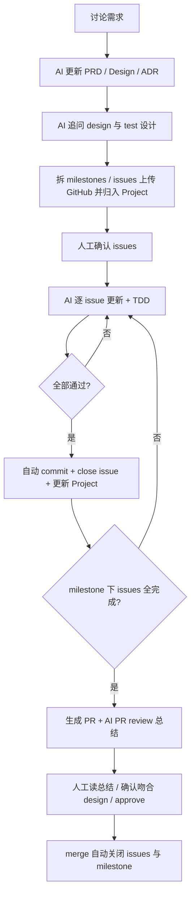

# 开发工作流（Dev Workflow）

> 本文件是 alfred-api 人机协作开发的**权威流程规范**，对应 `CONTEXT.md` §7 的「Vibe Coding」实践。
> 核心纪律：**先规范、后代码**——任何代码改动都必须先落到 PRD / Design / ADR，再写实现；文档未更新的 PR 不得合入。

## 生命周期总览

## 分阶段说明

### 1. 讨论需求 → 更新规范
- 在对话中澄清需求；AI 据此**先更新 PRD / Design / ADR**，不碰代码。
- 文档模板：`../prd/TEMPLATE.md`、`../adr/TEMPLATE.md`。
- 若改动涉及既有决策，新建 ADR 并标注 `superseded_by`，不得改写旧 ADR。

### 2. AI 追问 design 与 test 设计
- 在落笔前，AI 必须追问并固化：(a) 设计要点（接口 / 数据模型 / 边界），(b) 测试设计（验收条件、TDD 红-绿-重构路径）。
- 两者不明确前，不进入实现。

### 3. 拆 milestones / issues 并上传
- AI 将规范拆为 milestone 与 issue，用 `gh` 上传 GitHub 并归入对应 Project。
- **AI 自主权（Related vs Closes）**：对每个 issue，AI 自主判定其在 PR 中的归属：
  - 本 PR 的改动令该 issue 验收条件成立 → 归入 `Closes #`。
  - 仅同一领域 / 有依赖但**未修复** → 归入 `Related #`。
  - 此判定由 AI 决定，无需每次征求人工确认；人工在审阅 PR 时可纠正。
- 人工确认 issue 拆分无误后，AI 才开始逐 issue 实现。

### 4. 逐 issue 实现 + TDD
- 每个 issue：先写失败测试（红）→ 实现使通过（绿）→ 重构。
- 测试依据：PRD 的成功指标 + Design 的接口定义 + ADR 的约束 + 第 2 步的测试设计。
- 全部通过 → 自动 `git commit`、关闭该 issue、在 Project 中更新状态。

### 5. milestone 完成 → 生成 PR
- 一个 milestone 下所有 issue 关闭后，AI 生成 PR（基于 `.github/PULL_REQUEST_TEMPLATE.md`）。
- AI 附带 **PR review 总结**：对照 Design / ADR 说明改动是否吻合、遗留风险、测试覆盖。

### 6. 人工审阅 → approve → merge
- 人工阅读总结，确认实现与 design 吻合，approve。
- merge 时 GitHub 原生 `Closes #` 自动关闭对应 issue。
- **milestone 关闭**：GitHub 无原生「issue 全关即关 milestone」自动化；由人工或 `gh` 在 issue 全关后手动关闭 milestone（本仓库仅交付文档，不写 Actions）。

## 文档优先约束（硬性纪律）
- 任何代码 PR 必须先在 `docs/` 侧完成对应 PRD / Design / ADR 变更。
- PR 模板含 To-do checklist「已更新相关规范文档」；reviewer 据此把关，未更新文档的 PR 不 approve。
- 本约束为**流程软约束**（checklist + 人工审阅），不依赖 CI 强制阻断。

## 相关文档
- 规范分类与 frontmatter：`../../STYLE.md`
- 需求讨论入口：`../../CONTEXT.md` §7
- Issue 跟踪：`issue-tracker.md`
- 标签体系：`triage-labels.md`
- PR 模板：`.github/PULL_REQUEST_TEMPLATE.md`
