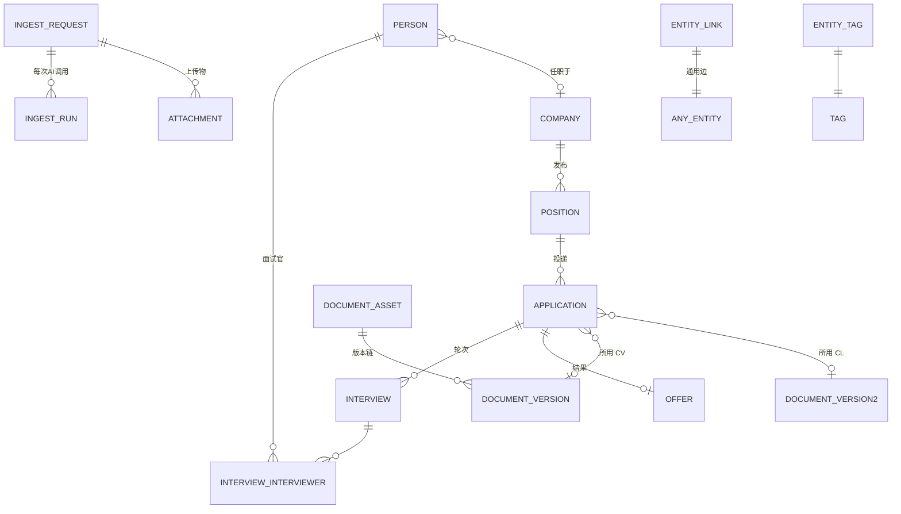
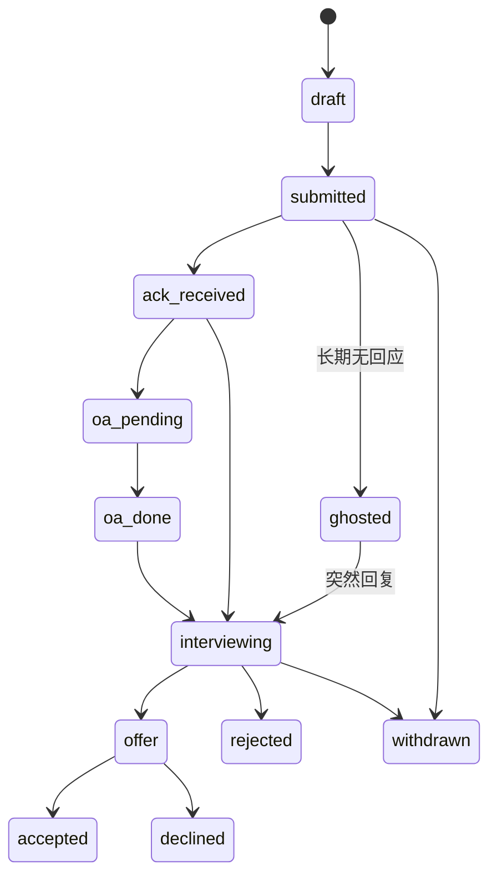

# Alfred 数据模型（PostgreSQL）— ⚠️ 旧模型，已过时

> **本文档是 V1 重新设计前的旧模型，仅作对照。权威模型见 [DATA_MODEL_V2.md](../../DATA_MODEL_V2.md)。**
> 决策背景：[design-sessions/2026-08-03-v1-redesign.md](../../design-sessions/2026-08-03-v1-redesign.md)；ADR 0009–0017。

> 配套：[SPEC](./SPEC.md) ｜ [术语表](../../GLOSSARY.md)
> 数据库：PostgreSQL 16 ｜ ORM：SQLModel ｜ 迁移：Alembic

---

## 0. 通用约定

### 0.1 每张表都有的公共列

| 列 | 类型 | 说明 |
|---|---|---|
| `id` | `uuid` PK | 默认 `gen_random_uuid()`（`pgcrypto`） |
| `created_at` | `timestamptz` | 默认 `now()` |
| `updated_at` | `timestamptz` | 触发器自动更新 |
| `archived_at` | `timestamptz` NULL | **软删除**。查询默认过滤 `archived_at IS NULL` |

### 0.2 AI 溯源列（凡可由 AI 生成的表都有）

| 列 | 类型 | 说明 |
|---|---|---|
| `origin` | `varchar` | `manual` \| `ingest` \| `skill` \| `import` |
| `ingest_request_id` | `uuid` NULL | 来自哪次 ingest，可回溯原始输入 |
| `confidence` | `real` NULL | AI 抽取置信度 0–1，冲突合并时取高者 |

> 这组列让"AI 填的"和"我自己填的"永远可区分，也让错误结果能顺藤摸瓜找到原始录音/截图。

### 0.3 枚举策略

**不使用 PostgreSQL 原生 ENUM 类型**，一律 `varchar` + Python `StrEnum` + 应用层校验（必要时加 `CHECK`）。
理由：PG 原生 enum 增删值需要 DDL 迁移，个人项目里枚举值会频繁演进，varchar 成本最低。

### 0.4 命名

表名单数下划线（`entity_link`），时间列后缀 `_at`，日期列后缀 `_on`，布尔前缀 `is_`，Markdown 文本后缀 `_md`。

### 0.5 必需扩展

```sql
CREATE EXTENSION IF NOT EXISTS pgcrypto;   -- gen_random_uuid()
CREATE EXTENSION IF NOT EXISTS pg_trgm;    -- 模糊匹配公司名/人名
```

---

## 1. 全景



节点共 13 张实体表 + 3 张关系/审计表。

---

## 2. 核心实体

### 2.1 `company` — 公司

| 列 | 类型 | 说明 |
|---|---|---|
| `name` | `varchar` NOT NULL | 显示名 |
| `slug` | `varchar` UNIQUE | 稳定短标识，`bytedance` |
| `aliases` | `text[]` | 别名，用于去重（"字节跳动"/"ByteDance"/"抖音集团"） |
| `website` | `varchar` | |
| `industry` | `text[]` | |
| `size_bucket` | `varchar` | `startup`\|`sme`\|`large`\|`mnc`\|`unknown` |
| `hq_location` | `varchar` | |
| `description_md` | `text` | 公司简介（AI 从材料中提取） |
| `visa_sponsorship_known` | `varchar` | `yes`\|`no`\|`unknown` |
| `interest_level` | `smallint` | 个人兴趣 1–5 |
| `is_blacklisted` | `boolean` | 避雷 |
| `blacklist_reason` | `text` | |

**去重键**：`lower(name)` 与 `aliases` 做 trigram 匹配；`upsert_company` 原语先查后建。
**索引**：`UNIQUE(slug)`、`GIN(aliases)`、`GIN(lower(name) gin_trgm_ops)`。

---

### 2.2 `position` — 岗位

| 列 | 类型 | 说明 |
|---|---|---|
| `company_id` | `uuid` FK → company | |
| `title` | `varchar` NOT NULL | 原始标题 |
| `job_family` | `varchar` | 归一化职位类别：`swe`\|`quant`\|`data`\|`pm`\|`research`\|… **支撑"某一类职位"作为 filter** |
| `seniority` | `varchar` | `intern`\|`new_grad`\|`junior`\|`mid`\|`senior`\|`lead`\|`unknown` |
| `employment_type` | `varchar` | `full_time`\|`part_time`\|`intern`\|`contract`\|`unknown` |
| `location` | `varchar` | |
| `work_mode` | `varchar` | `onsite`\|`hybrid`\|`remote`\|`unknown` |
| `visa_sponsorship` | `varchar` | `yes`\|`no`\|`unknown`（HK/JobsDB 场景刚需） |
| `salary_min` / `salary_max` | `numeric` | |
| `salary_currency` | `varchar(3)` | |
| `salary_period` | `varchar` | `year`\|`month`\|`day`\|`hour` |
| `description_md` | `text` | JD 正文 |
| `requirements` | `jsonb` | `[{text, kind: "must"\|"nice", category}]` |
| `apply_method` | `varchar` | `portal`\|`email`\|`referral`\|`wechat`\|`other` |
| `apply_url` / `apply_email` | `varchar` | 投递方式 |
| `posted_at` | `timestamptz` | 发布时间 |
| `deadline_at` | `timestamptz` | **截止日期**（自动生成提醒的依据） |
| `discovered_at` | `timestamptz` | **发现时间**，默认 `now()` |
| `source_kind` | `varchar` | `linkedin`\|`jobsdb`\|`wechat_mp`\|`xiaohongshu`\|`screenshot`\|`referral`\|`other` |
| `source_url` | `varchar` | |
| `status` | `varchar` | `watching`（观望）\|`shortlisted`\|`applying`\|`applied`\|`closed`\|`abandoned` |
| `interest_level` | `smallint` | 1–5，"我很喜欢" |
| `personal_comment_md` | `text` | 个人 comment 原话 |
| `fingerprint` | `varchar` UNIQUE NULL | 去重指纹 = `hash(company_id, normalized_title, location)` |
| `search_tsv` | `tsvector` GENERATED | `title + description_md`，GIN 索引 |

**索引**：`(company_id)`、`(status)`、`(deadline_at)`、`(job_family)`、`GIN(requirements)`、`GIN(search_tsv)`。

---

### 2.3 `person` — 人（猎头 / 内推人 / coffee chat 对象 / 面试官）

用户要求"每一个人都需要有一个 unique identifier"。

| 列 | 类型 | 说明 |
|---|---|---|
| `slug` | `varchar` UNIQUE NOT NULL | **人类可读唯一标识**，如 `jane-chen-hsbc`。这就是 unique identifier |
| `display_name` | `varchar` NOT NULL | |
| `full_name` | `varchar` | |
| `aliases` | `text[]` | 昵称/英文名/微信名 |
| `roles` | `text[]` | `recruiter`\|`referrer`\|`interviewer`\|`peer`\|`mentor`\|`friend`\|`alumni`（一人可多角色） |
| `email` / `phone` / `linkedin_url` / `wechat_id` | `varchar` | |
| `handles` | `jsonb` | 其他平台账号 |
| `current_company_id` | `uuid` FK NULL | |
| `current_title` | `varchar` | |
| `agency` | `varchar` | 猎头所属机构 |
| `location` / `timezone` | `varchar` | |
| `first_met_at` | `timestamptz` | |
| `last_contact_at` | `timestamptz` | |
| `next_followup_at` | `timestamptz` | |
| `summary_md` | `text` | 这个人的滚动画像（Skill 逐次更新） |
| `is_blacklisted` | `boolean` | |

**去重**：`UNIQUE(slug)`；`UNIQUE(lower(email)) WHERE email IS NOT NULL`；名字走 trigram 提示。
**索引**：`GIN(roles)`、`GIN(aliases)`、`(current_company_id)`、`(next_followup_at)`。

---

### 2.4 `application` — 投递实例

| 列 | 类型 | 说明 |
|---|---|---|
| `position_id` | `uuid` FK → position | |
| `company_id` | `uuid` FK → company | 冗余，便于按公司聚合 |
| `status` | `varchar` | 见下方状态机 |
| `submitted_at` | `timestamptz` | |
| `channel` | `varchar` | `portal`\|`email`\|`referral`\|`recruiter`\|`event`\|`other` |
| `channel_detail` | `varchar` | 具体平台 |
| `resume_version_id` | `uuid` FK → document_version | **这次用的哪版 CV** |
| `cover_letter_version_id` | `uuid` FK → document_version | **这次用的哪版 CL** |
| `portal_url` | `varchar` | 投递门户地址 |
| `portal_username` | `varchar` | 注册用的账号（不存密码） |
| `submission_payload_md` | `text` | **网页投递时填了什么信息**（粘贴文本 / 截图转写） |
| `answers` | `jsonb` | 结构化的申请表问答 `[{question, answer}]` |
| `referrer_person_id` | `uuid` FK → person | 内推人 |
| `recruiter_person_id` | `uuid` FK → person | 对接猎头/HR |
| `last_status_at` | `timestamptz` | 最近一次状态变化 |
| `next_followup_at` | `timestamptz` | 下次跟进 |
| `outcome_note_md` | `text` | |

**状态机**（`application.status`）：



**索引**：`(status)`、`(company_id)`、`(position_id)`、`(next_followup_at)`、`(submitted_at)`。
截图等佐证材料通过 `entity_link(application → attachment, relation='evidence')` 关联。

---

### 2.5 `document_asset` / `document_version` — 简历与 Cover Letter

> **设计说明**：设计讨论中提到的 `ResumeAsset` 与 `CoverLetterAsset` 在实现上**合并为同一对表**，用 `kind` 字段区分。
> 二者字段 100% 重合（都是 LaTeX 源码 + 版本链 + 投递引用），拆两套表只会产生重复代码和重复迁移。

`document_asset`（一份"文档档案"，比如"量化方向简历"）

| 列 | 类型 | 说明 |
|---|---|---|
| `kind` | `varchar` | `resume`\|`cover_letter`\|`portfolio`\|`other` |
| `name` | `varchar` | "Quant 方向 CV" |
| `slug` | `varchar` UNIQUE | |
| `description_md` | `text` | |
| `target_job_family` | `varchar` | 这份文档主打哪类岗位 |
| `template_source` | `text` | 用户提供的 LaTeX 模板原文 |
| `language` | `varchar` | `zh`\|`en` |

`document_version`（每一次改动 = 一个不可变版本）

| 列 | 类型 | 说明 |
|---|---|---|
| `asset_id` | `uuid` FK → document_asset | |
| `version_no` | `int` | 自增，`UNIQUE(asset_id, version_no)` |
| `label` | `varchar` | "投 HSBC 用的版本" |
| `source_format` | `varchar` | `latex`\|`markdown`\|`docx` |
| `source_content` | `text` | **完整 LaTeX 源码快照**（不可变） |
| `based_on_version_id` | `uuid` FK self | 版本链，可 diff |
| `diff_summary_md` | `text` | 这版改了什么（AI 生成） |
| `generated_by` | `varchar` | `manual`\|`skill`\|`ai_suggested` |
| `tailored_for_position_id` | `uuid` FK NULL | 为哪个岗位定制 |
| `checksum` | `varchar` | 源码 sha256，防重复存 |
| `pdf_path` | `varchar` NULL | **MVP 恒为 NULL**，v0.3+ 编译后写入 |
| `compiled_at` | `timestamptz` NULL | 同上 |
| `compile_log` | `text` NULL | 同上 |

> 这套结构直接回答用户的痛点："收到面试时忘了当初用的哪份 CV" → 从 `application.resume_version_id` 一跳即可拿到当时的完整源码。

---

### 2.6 `interview` — 面试

| 列 | 类型 | 说明 |
|---|---|---|
| `application_id` | `uuid` FK → application | |
| `round_no` | `int` | 第几轮 |
| `kind` | `varchar` | `oa`\|`written_test`\|`phone_screen`\|`technical`\|`system_design`\|`behavioral`\|`case`\|`hr`\|`onsite_loop`\|`final` |
| `scheduled_at` | `timestamptz` | **什么时候面试** |
| `duration_min` | `int` | |
| `mode` | `varchar` | `onsite`\|`video`\|`phone` |
| `location_or_link` | `varchar` | |
| `prep_md` | `text` | 面前准备要点 |
| `questions` | `jsonb` | `[{question, my_answer, self_rating}]` — **面试说了什么** |
| `self_feedback_md` | `text` | **面试的感受** |
| `sentiment` | `varchar` | `great`\|`good`\|`neutral`\|`bad`\|`terrible` |
| `confidence` | `smallint` | 1–5 自评把握 |
| `outcome` | `varchar` | `pending`\|`passed`\|`failed`\|`unknown` |
| `thankyou_sent_at` | `timestamptz` | 感谢信 |
| `next_followup_at` | `timestamptz` | **定期 follow-up 提醒** |

`interview_interviewer`（多对多）：`interview_id` + `person_id` + `role`（`main`\|`shadow`\|`hr`），`UNIQUE(interview_id, person_id)`。

---

### 2.7 `offer`

| 列 | 类型 | 说明 |
|---|---|---|
| `application_id` | `uuid` FK | |
| `company_id` | `uuid` FK | 冗余便于对比 |
| `position_title` | `varchar` | |
| `base_salary` / `bonus` / `equity_value` / `signing_bonus` | `numeric` | 拆项便于横向比 |
| `currency` | `varchar(3)` / `salary_period` `varchar` | |
| `benefits` | `jsonb` | |
| `location` / `work_mode` / `visa_sponsorship` | `varchar` | |
| `start_date` | `date` | |
| `deadline_at` | `timestamptz` | **决策截止**（自动提醒） |
| `status` | `varchar` | `received`\|`negotiating`\|`accepted`\|`declined`\|`expired`\|`rescinded` |
| `comparison_note_md` | `text` | 横向对比笔记 |
| `negotiation_log_md` | `text` | 谈判过程记录 |

---

### 2.8 `note` — 笔记 / 感触 / 心得 / 资料

用户要求：*结构化汇总，区分关键经验、情绪、想法，带日期，可链到任意实体。*

| 列 | 类型 | 说明 |
|---|---|---|
| `title` | `varchar` | AI 生成 |
| `body_md` | `text` | **Markdown 正文** |
| `kind` | `varchar` | `reflection`\|`lesson`\|`emotion`\|`idea`\|`research`\|`resource`\|`meeting`\|`todo_dump`\|`other` |
| `occurred_on` | `date` | **带日期**，支撑"某一天"作为 filter |
| `structured` | `jsonb` | **结构化汇总**：`{key_lessons:[], emotions:[{label,intensity}], ideas:[], action_items:[{text,due}], entities_mentioned:[]}` |
| `mood` | `smallint` | -2..+2 |
| `salience` | `smallint` | 1–5，重要程度（用于"只看关键的"） |
| `source_kind` | `varchar` | `text`\|`voice`\|`link`\|`image`\|`manual` |
| `source_url` | `varchar` | 经验帖原链接 |
| `search_tsv` | `tsvector` GENERATED | GIN |

链接到职位/公司/人/技能一律走 `entity_link`。

---

### 2.9 `event` — 领域无关时间轴

支撑"某一件事 / 某一类型的事 / 某一天"作为 filter，也是求职季后继续可用的通用底座。

| 列 | 类型 | 说明 |
|---|---|---|
| `kind` | `varchar` | `coffee_chat`\|`call`\|`email`\|`meeting`\|`application_submitted`\|`interview`\|`offer_received`\|`deadline`\|`follow_up`\|`reminder_fired`\|`note_added`\|`custom` |
| `title` | `varchar` | |
| `occurred_at` | `timestamptz` NOT NULL | |
| `ends_at` | `timestamptz` | |
| `location` | `varchar` | |
| `body_md` | `text` | 聊了什么 |
| `structured` | `jsonb` | `{topics:[], takeaways:[], action_items:[], intros_offered:[]}` |
| `sentiment` | `varchar` | |
| `primary_entity_type` / `primary_entity_id` | `varchar`/`uuid` | 主关联对象 |

参与者（coffee chat 对象）走 `entity_link(event → person, relation='participant')`。

**索引**：`(occurred_at DESC)`、`(kind)`、`(primary_entity_type, primary_entity_id)`。

---

### 2.10 `reminder`

| 列 | 类型 | 说明 |
|---|---|---|
| `title` | `varchar` NOT NULL | |
| `body_md` | `text` | |
| `due_at` | `timestamptz` NOT NULL | |
| `recurrence_rule` | `varchar` NULL | iCal RRULE，周期性跟进 |
| `channel` | `varchar` | `in_app`（MVP）\|`email`\|`wechat` |
| `status` | `varchar` | `pending`\|`sent`\|`snoozed`\|`done`\|`cancelled` |
| `snoozed_until` | `timestamptz` | |
| `fired_at` / `completed_at` | `timestamptz` | |
| `target_entity_type` / `target_entity_id` | `varchar`/`uuid` | 提醒关于什么 |
| `source` | `varchar` | `manual`\|`skill`\|`auto_deadline` |

**索引**：`(status, due_at)` — 调度器每分钟只扫这一个索引。

---

### 2.11 `tag` / `entity_tag`

`tag`：`name`、`slug` UNIQUE、`namespace`（`skill`\|`industry`\|`job_family`\|`topic`\|`emotion`\|`custom`）、`color`、`description`。
`entity_tag`：`tag_id` + `entity_type` + `entity_id`，`UNIQUE(tag_id, entity_type, entity_id)`，双向索引。

`namespace` 让"技能标签"和"情绪标签"不会互相污染。用户提到的 "某一种需要的 skill set" 就是 `namespace='skill'` 的 tag。

---

### 2.12 `attachment`

| 列 | 类型 | 说明 |
|---|---|---|
| `kind` | `varchar` | `image`\|`audio`\|`pdf`\|`text`\|`other` |
| `original_filename` / `mime_type` / `byte_size` | | |
| `storage_path` | `varchar` | MVP 本地路径，后续换对象存储只改 Storage 实现 |
| `sha256` | `varchar` UNIQUE | 同一张截图不重复存 |
| `width` / `height` / `duration_ms` | `int` | |
| `transcript` | `text` | 音频 STT 结果 / 图片视觉描述与 OCR |
| `transcript_provider` / `transcript_model` | `varchar` | |
| `transcript_at` | `timestamptz` | |
| `ingest_request_id` | `uuid` FK | |

> **原始材料永不丢**：即使 AI 解析全部失败，附件与转写仍在库里，可随时重跑。

---

## 3. 通用边：`entity_link`

这是整个"网状 filter"能力的核心。

| 列 | 类型 | 说明 |
|---|---|---|
| `source_type` | `varchar` | `company`\|`position`\|`person`\|`application`\|`interview`\|`offer`\|`note`\|`event`\|`attachment`\|`document_version`\|`reminder` |
| `source_id` | `uuid` | |
| `target_type` / `target_id` | 同上 | |
| `relation` | `varchar` | 见下方关系词表 |
| `weight` | `real` | 关联强度 |
| `note` | `varchar` | 为什么链 |
| `origin` / `confidence` | | AI 溯源 |

**约束**：`UNIQUE(source_type, source_id, target_type, target_id, relation)`
**索引**：`(source_type, source_id)`、`(target_type, target_id)`、`(relation)` —— 双向可查。

### 关系词表（受控词汇，防止 AI 自由发挥造成语义碎片）

| relation | 语义 | 典型用法 |
|---|---|---|
| `mentions` | 提及 | note → company / position / person |
| `about` | 主题是 | note → position |
| `works_at` | 任职于 | person → company |
| `referred_by` | 被谁内推 | application → person |
| `interviewed_by` | 被谁面试 | application → person |
| `participant` | 参与者 | event → person |
| `evidence` | 佐证材料 | application → attachment |
| `derived_from` | 派生自 | note → attachment |
| `requires_skill` | 需要技能 | position → tag(skill) |
| `similar_to` | 类似 | position → position |
| `related_to` | 泛关联（兜底） | any → any |
| `blocks` / `follows_up` | 任务关系 | reminder → any |

> 新增 relation 需在词表登记（一行代码 + 一行文档），**不允许 AI 输出未登记的 relation**——校验层会拒绝并降级为 `related_to`。

---

## 4. 审计与可观测：`ingest_request` / `ingest_run`

### `ingest_request`（一次用户输入）

| 列 | 说明 |
|---|---|
| `raw_text` | 用户打的字 / 语音转写全文 |
| `link_url` | |
| `requested_skill` | 用户显式指定的技能 |
| `detected_skill` | 路由选出的技能 |
| `status` | `received`\|`running`\|`partial`\|`succeeded`\|`failed` |
| `dry_run` | `boolean` |
| `summary_md` | 助理回给用户的话 |
| `error` | |
| `finished_at` | |

### `ingest_run`（一次 AI 调用 / 一个 chunk）

| 列 | 说明 |
|---|---|
| `request_id` | FK |
| `skill_name` / `skill_version` | |
| `stage` | `normalize`\|`route`\|`extract`\|`reduce` |
| `chunk_index` / `chunk_total` | **分块流水线的每一段单独一行，可单独重试** |
| `provider` / `model` | |
| `prompt_tokens` / `completion_tokens` / `latency_ms` | 成本与性能 |
| `status` | `ok`\|`schema_error`\|`provider_error`\|`fallback` |
| `raw_response` | `jsonb`，模型原始输出 |
| `parsed` | `jsonb`，校验后的结构 |
| `error` | |

**索引**：`(request_id, chunk_index)`、`(status)`、`(created_at DESC)`。

---

## 5. 查询模式

### 5.1 通用过滤（`POST /v1/query`）

```sql
-- 例：查"所有和 某人 相关、带 quant 标签、7月发生的、笔记与事件"
SELECT ... FROM note n
WHERE n.archived_at IS NULL
  AND n.occurred_on BETWEEN :from AND :to
  AND EXISTS (SELECT 1 FROM entity_tag et JOIN tag t ON t.id = et.tag_id
              WHERE et.entity_type='note' AND et.entity_id=n.id AND t.slug = ANY(:tags))
  AND EXISTS (SELECT 1 FROM entity_link l
              WHERE (l.source_type='note' AND l.source_id=n.id
                     AND l.target_type=:rt AND l.target_id=:rid)
                 OR (l.target_type='note' AND l.target_id=n.id
                     AND l.source_type=:rt AND l.source_id=:rid))
```

### 5.2 邻居 / 子图（`GET /v1/entities/{type}/{id}/graph?depth=2`）

递归 CTE 展开 `entity_link` 双向邻居 + 强外键关系，深度默认 1，上限 3，节点上限 200。

### 5.3 漏斗统计（`GET /v1/stats/funnel`）

按 `application.status` 分组计数 + 回复率（`ack_received 及以后 / 总投递`）+ 面试率 + Offer 率，按月分桶。

---

## 6. 迁移与种子

- 迁移：`alembic revision --autogenerate` → 人工检查 → `alembic upgrade head`
- 种子：`scripts/seed.py` 灌入受控词表（relation、tag namespace、示例 job_family）与 1 家 demo 公司，供本地联调
- **不迁移旧 jobhunter SQLite 数据**：旧库是原型试验数据，结构差异大，用户未要求保留（如需迁移，另开一次性脚本）
