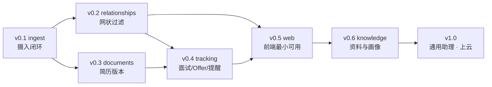

# Alfred 路线图（Version / Milestone）

> ⚠️ **本文件属于 v0.1 基线草稿，已作废。** 当前权威规范见顶层 [`DATA_MODEL_V2`](../../DATA_MODEL_V2.md)、[`UPLOAD_WORKFLOW`](../../UPLOAD_WORKFLOW.md)、[`ADR 0009–0017`](../../adr/README.md)。本文档仅供历史追溯。
>
> 配套：[SPEC](./SPEC.md) ｜ [ADR](../../adr/README.md)
> 跟踪方式：GitHub Milestone + Issue + Label（见 §7）

---

## 0. 分期原则

1. **每个版本自身可用**，不是"半成品堆叠"。
2. **后端优先**（用户已确认："先把后端 DB 与 API 全套做扎实"）。
3. **TDD**：每个 Issue 先写失败测试，再写实现。
4. 一个版本内**不引入两项重依赖**（例：LaTeX 编译不和数据模型重构同期做）。

---

## v0.1 — `ingest` 打通摄入闭环 🎯 当前目标

**目标**：能对 Alfred 说一句话/发一张截图，它把结构化数据存进 PostgreSQL，并能查回来。

| # | 交付项 |
|---|---|
| 1 | 仓库骨架：`pyproject.toml`(uv) / `docker-compose.yml`(PG16) / `.env.example` / `Makefile` |
| 2 | 配置层 `Settings`（pydantic-settings）+ 数据库会话 + Alembic 初始化 ✅ |
| 3 | **全部 13 张实体表 + `entity_link` + 审计表**的 SQLModel 定义与首次迁移 ✅ |
| 4 | Provider 抽象：`LLMProvider` / `VisionProvider` / `STTProvider` Protocol + OpenAI 兼容实现 + **FakeProvider** ✅ |
| 5 | `GET /health`、`GET /v1/llm-ping` ✅ |
| 6 | Services 层核心 Action 原语：`upsert_company` / `upsert_position` / `upsert_person` / `create_note` / `create_event` / `create_reminder` / `add_tags` / `link` ✅ |
| 7 | Skill 框架：`SkillManifest` 校验、registry 扫描加载、模板渲染、schema 校验与纠错重试、Action 执行器（事务 + dry-run） ✅ |
| 8 | 内置技能三件套：`extract_job`（声明式）、`capture_note`（声明式，兼兜底）、`coffee_chat`（脚本式，含分块）✅ |
| 9 | `POST /v1/attachments` + STT / 视觉转写 ✅ |
| 10 | `POST /v1/ingest`（四模态）、`GET /v1/ingest/{id}`、`POST /v1/ingest/{id}/retry` ✅ |
| 11 | 基础 CRUD：companies / positions / people / notes ✅ |
| 12 | pytest 体系：service 单测 + skill 单测（Fake provider）+ API 契约测 ✅ |

**验收**：
- 发一段"字节量化岗，8/30 截止，想投"的文字 → 库里出现 company + position + reminder，`GET /v1/positions` 能查到
- 发一段 1 万字 coffee chat 转写 → 自动分块、合并、建出 person + event + 待办提醒
- 拔掉 API key → ingest 仍返回 `partial`，原始输入被存成 note，不报 500
- `pytest` 在无 key、无外网环境全绿

---

## v0.2 — `relationships` 网状关联与万能过滤

**目标**：兑现"任何东西都能当 filter"。

| # | 交付项 |
|---|---|
| 1 | `POST/DELETE /v1/links`，relation 受控词表校验 |
| 2 | `GET /v1/entities/{type}/{id}/links` 与 `/graph?depth=`（递归 CTE，深度≤3、节点≤200） |
| 3 | **`POST /v1/query` 通用过滤端点**（实体类型 / 关联对象 / 标签 / 时间段 / 状态 / 全文） |
| 4 | `GET /v1/timeline`（按天分桶，合并 event/application/interview/note） |
| 5 | 全文检索：`tsvector` 生成列 + GIN；`pg_trgm` 模糊匹配公司名/人名 |
| 6 | Tag 体系与 namespace，`GET /v1/meta/vocab` |
| 7 | 异步 ingest（`async=true` + 轮询），长录音不再阻塞请求 |

**验收**：能一次查出"和某个人相关的、带 quant 标签的、7 月发生的所有笔记与事件"。

---

## v0.3 — `documents` 简历与 Cover Letter

**目标**：投递时用了哪版 CV/CL，永远查得到；AI 能针对岗位改简历。

| # | 交付项 |
|---|---|
| 1 | `document_asset` / `document_version` API + 版本链 + diff |
| 2 | `POST /v1/documents/{id}/tailor`：针对 `position_id` 出修改建议 / 生成新版本 |
| 3 | 新技能 `tailor_resume`（脚本式：读岗位要求 → 对照简历 → 逐段改写 → 存新版本 + diff 摘要） |
| 4 | 新技能 `parse_submission`：从投递回执截图/粘贴文本还原投递信息，回填 `application` |
| 5 | `POST /v1/applications` 全流程：状态机校验 + CV/CL 版本绑定 |
| 6 | **（评估）LaTeX 编译**：独立 `texlive` 容器 + `/compile` 端点，见 [ADR-0006](../../adr/0006-defer-latex-pdf-compilation.md) |

**验收**：从一次投递记录一跳拿到当时的 CV 完整 LaTeX 源码。

---

## v0.4 — `tracking` 面试、Offer 与提醒引擎

**目标**：投递之后的全流程不再靠记忆。

| # | 交付项 |
|---|---|
| 1 | `interview` 全 API：轮次、类型、面试官关联、问题记录、自评与感受 |
| 2 | `offer` 全 API：薪资拆项、横向对比、谈判记录 |
| 3 | **提醒引擎**：APScheduler 每分钟扫描 → 触发 → 写 `event(reminder_fired)`；`snooze` / `done` |
| 4 | 自动提醒规则：岗位截止前 N 天、投递后 N 天无回应转 `ghosted` 并提醒、面试后跟进 |
| 5 | 新技能 `log_interview`（语音复盘 → 结构化问题清单 + 感受 + 下次跟进） |
| 6 | `GET /v1/stats/funnel` 与 `GET /v1/stats/activity` |

**验收**：面完一场用语音复盘 → 自动建 interview 记录 + 3 天后的跟进提醒；漏斗看板显示本月转化率。

---

## v0.5 — `web` 前端最小可用（`alfred-web` 仓库启动）

**目标**：不用 curl 也能用。

| # | 交付项 |
|---|---|
| 1 | Taro + React + TS 脚手架，`openapi-typescript` 生成类型 |
| 2 | **对话页**：文字输入 + 录音 + 图片上传 + 链接粘贴 → 调 `/v1/ingest`，展示 `summary_md` 与创建的实体 |
| 3 | 列表与详情页：职位 / 投递 / 笔记 / 人脉 |
| 4 | 万能筛选页（对接 `POST /v1/query`）+ 时间轴 |
| 5 | 提醒中心 |
| 6 | H5 与微信小程序双端跑通 |

---

## v0.6 — `knowledge` 资料消化与人脉画像

| # | 交付项 |
|---|---|
| 1 | 新技能 `digest_resource`：经验帖/文章 → 结构化要点，自动链到职位类别或公司 |
| 2 | 人物滚动画像：每次交互后增量更新 `person.summary_md` |
| 3 | 关系图可视化端点（供前端画网状图） |
| 4 | 相似岗位推荐（基于 tag + embedding，可选） |

---

## v1.0 — 通用助理与上云

**目标**：求职季结束后，Alfred 继续服务于工作与社交。

| # | 交付项 |
|---|---|
| 1 | 去求职化的通用视图：项目 / 目标 / 人脉 / 日志 |
| 2 | 鉴权（单用户 token → 可选多用户） |
| 3 | **Skill 脚本沙箱**：子进程隔离 + 资源限额 + 网络白名单（多用户前置条件） |
| 4 | 附件切换对象存储（S3 兼容），`Storage` 接口已预留 |
| 5 | 真实推送通道：邮件 / 微信 |
| 6 | 部署：Docker 镜像 + 备份策略（`pg_dump` 定时） |

---

## 6. 版本与依赖关系



---

## 7. GitHub 跟踪方案（MCP）

用户已确认使用 **GitHub MCP** 建立 milestone / issues / label 跟踪。

### 7.1 Milestone

每个版本一个 Milestone，标题与本文一致：

```
v0.1-ingest · v0.2-relationships · v0.3-documents
v0.4-tracking · v0.5-web · v0.6-knowledge · v1.0-assistant
```

Milestone 描述 = 本文对应章节的「目标 + 验收」。

### 7.2 Label（标签体系）

| 类别 | 标签 |
|---|---|
| 层次 | `area:models` `area:services` `area:skills` `area:providers` `area:api` `area:infra` `area:docs` `area:web` |
| 类型 | `type:feature` `type:bug` `type:refactor` `type:test` `type:chore` |
| 优先级 | `p0-blocker` `p1-high` `p2-normal` `p3-later` |
| 流程 | `needs-design` `needs-decision`（需要写 ADR）`good-first-task` |

### 7.3 Issue 约定

- **一个 Issue = 一个可独立交付、可独立测试的单元**（对应上文表格的一行）
- 标题格式：`[area] 动词 + 对象`，例：`[skills] 实现 SkillManifest 校验与 registry 扫描加载`
- 正文模板：

```markdown
## 目标
（这个 Issue 做完之后，什么变成可能了）

## 验收标准
- [ ] 可观察的行为 1
- [ ] 可观察的行为 2

## 测试（TDD，先写）
- [ ] tests/xxx_test.py::test_yyy

## 关联
Milestone: v0.1-ingest ｜ ADR: ADR-0004 ｜ 依赖: #12
```

### 7.4 分支与提交

- 分支：`feat/<issue-no>-<slug>`，例 `feat/17-skill-registry`
- 提交：Conventional Commits（`feat(skills): ...` / `fix(api): ...` / `docs(adr): ...`）
- PR 描述里写 `Closes #17`，合并自动关闭 Issue 并计入 Milestone 进度

### 7.5 Git Tag

每个 Milestone 全部关闭后打 tag：`v0.1.0`、`v0.2.0`…，并在 Release Notes 里附该版本的验收结论。

### 7.6 执行说明

GitHub MCP 在**实现期**连接。首次连通后按本文一次性创建：7 个 Milestone + 全套 Label + v0.1 的 12 个 Issue（后续版本的 Issue 在进入该版本时再建，避免过早细化）。
