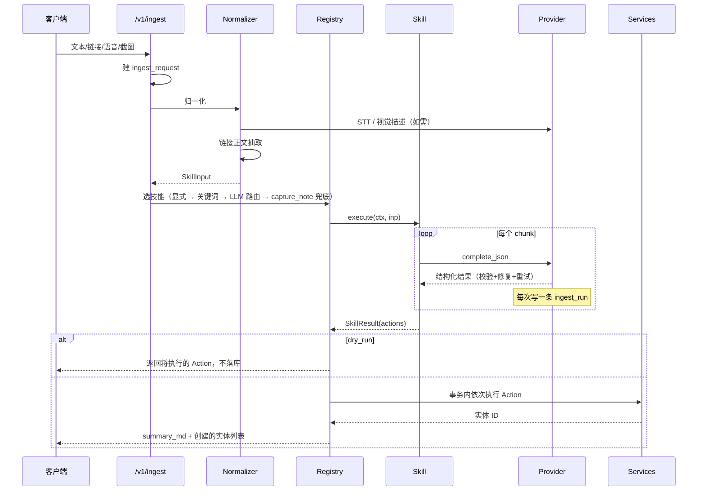

# Alfred Skills 系统规范

> 配套：[SPEC](./SPEC.md) ｜ [数据模型](./DATA_MODEL.md) ｜ [ADR-0004](../../adr/0004-scriptable-skill-directories.md)

---

## 1. 什么是 Skill

**Skill = 你把一个重要流程总结成的"技能包"。**

它是一个**目录**，不是一段写死在后端里的 Python 函数。你想让 Alfred 学会一件新事（比如"整理一场行业分享会的笔记"），你新建一个目录、写一份说明书，重启（或热加载）后 Alfred 就会了——**不用改后端代码**。

```
app/skills/
├── _registry.py            # 框架：扫描、校验、加载
├── _runtime.py             # 框架：SkillContext / SkillInput / SkillResult / Action
├── extract_job/
│   ├── skill.yaml          # 说明书（必需）
│   └── run.py              # 脚本（可选）
├── coffee_chat/
│   ├── skill.yaml
│   └── run.py
└── capture_note/
    └── skill.yaml          # 只有说明书 → 走通用流水线
```

两种形态：

| 形态 | 内容 | 适用 |
|---|---|---|
| **声明式** | 只有 `skill.yaml` | 一次 AI 调用就能搞定的抽取任务 |
| **脚本式** | `skill.yaml` + `run.py` | 需要多步编排、条件分支、自定义合并逻辑 |

**两者对外接口完全一致**，`POST /v1/ingest` 不感知差异。

---

## 2. `skill.yaml` 规范

```yaml
# ---- 身份 ----
name: extract_job                 # 必需，唯一，snake_case，= 目录名
version: 1                        # 必需，改 prompt/schema 时递增（写入 ingest_run 便于回溯）
description: >                    # 必需。也用于自动路由，写清楚"什么时候该用我"
  从职位链接、截图或口述中拆解出公司、岗位、要求、投递方式、截止日期，
  并记录我对这个职位的个人评价与兴趣程度。
enabled: true

# ---- 路由：什么时候触发我 ----
match:
  inputs: [text, link, image, audio]   # 能处理哪些模态
  keywords: ["职位", "岗位", "招聘", "jd", "job", "hiring", "linkedin", "jobsdb"]
  url_patterns: ["linkedin.com/jobs", "jobsdb.com"]
  priority: 80                    # 0-100，多个命中时取高者

# ---- 长输入策略（用户关心的核心点）----
chunking:
  strategy: none                  # none | fixed | topic
  max_chars: 6000                 # 超过才分块
  overlap_chars: 200              # fixed 模式的重叠，避免切断句子
  reduce: false                   # 分块后是否再做一次全局归并调用

# ---- 给 AI 的指令（Jinja2 模板）----
prompt:
  system: |
    你是一个求职助理，负责把杂乱的招聘信息拆成结构化数据。
    只输出 JSON，不要解释。信息缺失时留 null，绝不编造。
    今天是 {{ now.date() }}。
  user: |
    来源链接：{{ input.link }}
    我说的话：{{ input.transcript }}
    材料正文：
    {{ input.text }}

# ---- AI 必须返回的结构 ----
output_schema:
  type: object
  required: [company_name, position_title]
  properties:
    company_name:      { type: string }
    company_description: { type: string, nullable: true }
    position_title:    { type: string }
    job_family:        { type: string, enum: [swe, quant, data, pm, research, other], nullable: true }
    location:          { type: string, nullable: true }
    work_mode:         { type: string, enum: [onsite, hybrid, remote, unknown] }
    visa_sponsorship:  { type: string, enum: [yes, no, unknown] }
    requirements:
      type: array
      items:
        type: object
        properties:
          text: { type: string }
          kind: { type: string, enum: [must, nice] }
    skills:            { type: array, items: { type: string } }
    apply_method:      { type: string, enum: [portal, email, referral, wechat, other] }
    apply_url:         { type: string, nullable: true }
    deadline:          { type: string, format: date-time, nullable: true }
    my_comment:        { type: string, nullable: true }
    interest_level:    { type: integer, minimum: 1, maximum: 5, nullable: true }
    reminder:
      type: object
      nullable: true
      properties:
        title: { type: string }
        due:   { type: string, format: date-time }

# ---- AI 返回后做什么（只能用固定原语）----
actions:
  - upsert_company:
      name: "{{ out.company_name }}"
      description_md: "{{ out.company_description }}"
      as: company                       # 结果起个别名，供后续 action 引用
  - upsert_position:
      company_id: "{{ company.id }}"
      title: "{{ out.position_title }}"
      job_family: "{{ out.job_family }}"
      location: "{{ out.location }}"
      work_mode: "{{ out.work_mode }}"
      visa_sponsorship: "{{ out.visa_sponsorship }}"
      requirements: "{{ out.requirements }}"
      apply_method: "{{ out.apply_method }}"
      apply_url: "{{ out.apply_url }}"
      deadline_at: "{{ out.deadline }}"
      source_kind: "{{ input.source_kind }}"
      source_url: "{{ input.link }}"
      interest_level: "{{ out.interest_level }}"
      personal_comment_md: "{{ out.my_comment }}"
      as: position
  - add_tags:
      entity: "{{ position.ref }}"
      namespace: skill
      names: "{{ out.skills }}"
  - create_reminder:
      when: "{{ out.reminder is not none }}"     # 条件执行
      title: "{{ out.reminder.title }}"
      due_at: "{{ out.reminder.due }}"
      target: "{{ position.ref }}"
      source: skill
  - create_reminder:
      when: "{{ out.deadline is not none }}"
      title: "【截止】{{ out.position_title }} @ {{ out.company_name }}"
      due_at: "{{ out.deadline | days_before(3) }}"
      target: "{{ position.ref }}"
      source: auto_deadline
```

### 字段速查

| 字段 | 必需 | 说明 |
|---|---|---|
| `name` / `version` / `description` | ✅ | 身份与路由依据 |
| `enabled` | | 默认 `true` |
| `match.inputs` | ✅ | 支持的模态 |
| `match.keywords` / `url_patterns` / `priority` | | 路由预筛 |
| `chunking.strategy` | | `none`(单步) / `fixed`(定长+重叠) / `topic`(先让 AI 划分主题再切) |
| `prompt.system` / `prompt.user` | 声明式必需 | Jinja2 模板 |
| `output_schema` | 声明式必需 | JSON Schema 子集，用于**强制校验 AI 输出** |
| `actions` | 声明式必需 | 有序的 Action 原语列表 |

清单本身由 Pydantic 模型 `SkillManifest` 校验；**写错了启动不会崩**，该 skill 被标记为 `invalid` 并在 `GET /v1/skills` 里报错原因。

---

## 3. Action 原语表

Action 是 Skill 唯一被允许的"副作用"。每个原语一一对应 `app/services/` 里的一个函数，**与 REST 路由共用**。

| 原语 | 作用 | 关键参数 |
|---|---|---|
| `upsert_company` | 建/更新公司（按名称+别名去重） | `name`, `aliases`, `description_md`, … |
| `upsert_position` | 建/更新岗位（按 fingerprint 去重） | `company_id`, `title`, `deadline_at`, … |
| `upsert_person` | 建/更新人（按 slug/email 去重） | `display_name`, `roles`, `email`, … |
| `create_application` | 记录一次投递 | `position_id`, `channel`, `resume_version_id`, … |
| `create_interview` | 记录面试轮次 | `application_id`, `round_no`, `kind`, … |
| `create_offer` | 记录 offer | `application_id`, 薪资拆项 |
| `create_note` | 建笔记 | `body_md`, `kind`, `occurred_on`, `structured` |
| `create_event` | 建时间轴事件 | `kind`, `occurred_at`, `structured` |
| `create_reminder` | 建提醒 | `title`, `due_at`, `target` |
| `add_tags` | 打标签 | `entity`, `namespace`, `names[]` |
| `link` | 建通用边 | `source`, `target`, `relation` |
| `attach` | 关联附件 | `entity`, `attachment_id`, `relation` |
| `update_entity` | 局部更新已有实体 | `entity`, `patch` |
| `create_document_version` | 新增 CV/CL 版本 | `asset_id`, `source_content`, `based_on` |

所有原语：

- 参数经 **Pydantic 校验**，类型错就拒绝（不会写脏数据）
- 每次执行写入 `ingest_run.parsed` 审计
- 一次 ingest 的全部 Action 在**同一个事务**里提交
- `relation` 必须在[受控词表](./DATA_MODEL.md#关系词表受控词汇防止-ai-自由发挥造成语义碎片)内

模板里可用的辅助：`{{ x.ref }}`（实体引用）、`{{ x.id }}`、过滤器 `days_before(n)` / `default(v)` / `slugify`、条件 `when:`。

---

## 4. `run.py` 契约（脚本式 Skill）

```python
from alfred.skills import SkillContext, SkillInput, SkillResult, actions as A

SKILL_VERSION = 2

async def execute(ctx: SkillContext, inp: SkillInput) -> SkillResult:
    """整理一场 coffee chat：长录音 → 分段抽取 → 合并 → 更新人物画像。"""
    text = inp.transcript or inp.text

    # 1. 自行决定单步还是分块（对外接口不变）
    chunks = ctx.chunk(text, strategy="topic", max_chars=6000)

    partials = []
    for i, ch in enumerate(chunks):
        res = await ctx.llm.complete_json(
            system=ctx.render("prompt.system"),
            user=ctx.render("prompt.user", chunk=ch, index=i, total=len(chunks)),
            schema=ctx.manifest.output_schema,
        )
        partials.append(res.data)          # 每次调用自动记入 ingest_run

    merged = ctx.merge(partials, key="person_name")   # 框架提供的去重合并

    # 2. 产出 Action，由框架统一执行（可审计、可 dry-run、同事务）
    out = SkillResult(summary_md=merged.get("summary"))
    person = out.add(A.UpsertPerson(display_name=merged["person_name"],
                                    roles=merged.get("roles", []),
                                    current_title=merged.get("title")))
    event = out.add(A.CreateEvent(kind="coffee_chat",
                                  occurred_at=merged.get("met_at") or ctx.now(),
                                  body_md=merged["summary"],
                                  structured=merged["structured"]))
    out.add(A.Link(source=event, target=person, relation="participant"))
    for item in merged.get("action_items", []):
        out.add(A.CreateReminder(title=item["text"], due_at=item["due"], target=person))
    return out
```

### `SkillContext` 暴露什么

| 成员 | 说明 |
|---|---|
| `ctx.llm` / `ctx.vision` / `ctx.stt` | Provider 实例（测试时自动替换为 Fake） |
| `ctx.manifest` | 当前 skill 的 `skill.yaml`（已校验） |
| `ctx.render(path, **vars)` | 渲染 yaml 里的模板 |
| `ctx.chunk(text, strategy, max_chars)` | 分块工具 |
| `ctx.merge(parts, key)` | 分块结果合并去重 |
| `ctx.now()` / `ctx.settings` / `ctx.logger` | |
| `ctx.services` | **逃生舱**：直接调服务层。绕过审计与 dry-run，非必要不用 |

### `SkillInput`

`text` · `link` · `transcript` · `attachments[]` · `source_kind` · `hints`（用户附加说明）· `requested_skill`

### `SkillResult`

`actions[]` · `summary_md`（回给用户的话）· `warnings[]` · `raw`（调试用）

---

## 5. 执行流程



### 技能选择顺序

1. 请求里显式 `skill=xxx` → 直接用
2. `match.keywords` / `url_patterns` / `inputs` 预筛，命中唯一 → 用它
3. 多个命中或零命中 → **路由调用**：把所有 skill 的 `name + description` 交给 LLM，返回最合适的一个 + 置信度
4. 置信度低或路由失败 → 兜底 `capture_note`（**至少把话记下来，绝不丢输入**）

---

## 6. 加载与热更新

- 启动时扫描 `SKILLS_DIR`（默认 `app/skills`，可用环境变量指向仓库外的私人技能目录）
- `skill.yaml` 用 `SkillManifest` 校验；`run.py` 用 `importlib` 加载并检查 `execute` 是异步函数、签名正确
- **单个 skill 出错不影响启动**，记入 `registry.errors`，通过 `GET /v1/skills` 可见
- `POST /v1/skills/reload` 热重载，改完 yaml 不用重启
- `GET /v1/skills/{name}` 返回清单详情 + 最近运行统计

---

## 7. 内置技能（MVP 三个）

| 技能 | 形态 | 职责 |
|---|---|---|
| `extract_job` | 声明式 | 职位拆解：公司/岗位/要求/投递方式/截止/个人评价 + 自动截止提醒 |
| `capture_note` | 声明式 | 心得笔记：Markdown 正文 + 关键经验/情绪/想法/待办结构化 + 自动链实体（**同时是兜底技能**） |
| `coffee_chat` | 脚本式 | 长录音分段抽取 → 合并 → 建人物+事件+待办提醒 → 更新人物画像 |

后续（v0.3+）：`tailor_resume`、`parse_submission`（投递回执/截图）、`digest_resource`（经验帖）、`log_interview`。

---

## 8. 安全边界

当前是**单人本地**场景，`run.py` 是你自己写的代码，**直接在主进程执行**，不做沙箱——这是刻意的取舍（换取脚本能力最大化）。

未来若上多用户/云端，必须补：子进程隔离 + 资源限额 + 文件系统与网络白名单。已记入 [ROADMAP](./ROADMAP.md) v1.0。

---

## 9. 测试

每个 skill 至少三条测试（用 `FakeProvider`，零网络零 key）：

1. **Happy path**：给定 fixture 输入 → 断言产出的 Action 列表结构正确
2. **Schema 违规**：模型返回缺字段 → 断言触发纠错重试，最终降级不崩
3. **长输入分块**：超长文本 → 断言切成 N 段、合并后无重复实体

框架层测试：清单校验、路由优先级、dry-run 不写库、Action 事务回滚。
