# Alfred 上传工作流设计说明

> 面向人：产品负责人（你自己）+ 后续实现的人
> 配套：[数据模型](./DATA_MODEL.md) ｜ [技能规范](./SKILLS.md) ｜ [接口](./API.md)
> 可视化版本：`ui/workflow.html`（同样的内容，带可交互图）

---

## 0. 这份文档在说什么

只讲一件事：**东西是怎么从"你随手发一段话/一张截图"变成"库里干净、能查、能复用的数据"的。**

投递之后的分析、统计、提醒不在这里展开。

### 0.1 已经拍板的三个决策

| 议题 | 结论 | 为什么 |
|---|---|---|
| 技能库怎么建 | **AI 提议 + 你确认**，确认后才进正式词表 | 防止「Excel / Microsoft Excel / 熟练使用 Excel」变成三个技能 |
| 个人经历放哪 | **单独建一张表**，和「笔记/想法」彻底分开 | 经历是"简历素材"，要能被反复挑用；笔记是"我的情绪和判断"，两者用途完全不同 |
| 和 Alfred 的对话怎么存 | **双方都存**，我发的和它回的都带时间戳 | 你要的是一条像微信一样能回看的时间线 |

### 0.2 一句话概括整条链路

```
你发东西  →  原样存档（永不丢）  →  AI 拆解  →  你过目确认  →  正式入库  →  以后随时调用
```

**最关键的一步是「你过目确认」。** 没有它，截图认错的公司名、AI 瞎编的截止日期，会悄无声息地污染整个库。

---

## 1. 名词对照表（口语 → 系统里的叫法）

| 你平时说的 | 系统里的名字 | 一句话解释 |
|---|---|---|
| 公司 | `company` | 一家公司只存一条，不管它在几个地方出现 |
| 岗位 / 职位 | `position` | 某家公司的某个具体职位 |
| 职位大类 | `position.job_family` | 心理咨询 / 数据 / 研究…… 用来做"筛某一类岗位" |
| 技能 | `skill` | **新表**。两层：大类 → 细分 |
| 岗位要求 | `position_requirement` | **新表**。JD 里的每一条要求单独一行 |
| 我的经历 | `experience` | **新表**。可反复挑进简历的素材 |
| 简历 / 求职信 | `document_asset` + `document_version` | 档案 + 每一版快照 |
| 我的想法/评价 | `note` | 主观内容 |
| 我和 Alfred 的聊天 | `chat_message` | **新表**。双方消息，带时间戳 |
| 我发的那次东西 | `ingest_request` | 原始输入存档 + 处理状态 |
| 语音/图片原件 | `attachment` | 原文件 + 转写文字 |
| 投递记录 | `application` | 投了哪家哪个岗，用的哪版简历 |
| 面试 | `interview` | 每一轮单独一条 |
| 任意两样东西的关联 | `entity_link` | 万能连线：这条笔记是关于那个岗位的 |

---

## 2. 核心实体与唯一标识

### 2.1 唯一键总表

| 实体 | 唯一键 | 长什么样 | 冲突了怎么办 |
|---|---|---|---|
| 公司 `company` | `slug` | `bytedance`、`hku-psychology` | 先按 slug 查，再按别名做模糊匹配；命中就复用，不新建 |
| 岗位 `position` | `fingerprint` | `sha256(公司id + 标准化职位名 + 地点)` | 同一个岗位从小红书和 LinkedIn 各发一次 → 只留一条，来源附加上去 |
| 技能 `skill` | `slug` | 大类 `english`；细分 `english/business-writing` | 归一化后仍不命中 → 建成 `proposed` 状态等你确认 |
| 岗位要求 `position_requirement` | `(position_id, 要求原文的哈希)` | — | 同一句要求重复解析只留一条 |
| 经历 `experience` | `slug` | `hku-psy-ra-2025` | 你自己命名，重名直接拒绝 |
| 简历档案 `document_asset` | `slug` | `cv-clinical-psy` | — |
| 简历版本 `document_version` | `(asset_id, version_no)` + 内容 `checksum` | `cv-clinical-psy #7` | 内容没变就不新建版本 |
| 投递 `application` | `id`（业务软约束 `position_id + 投递日`） | — | 同岗二投是合法的，不去重，但会提醒你"这个岗你 3 月投过" |
| 聊天消息 `chat_message` | `id` + `sent_at` | — | 客户端重发用 `idempotency_key` 挡掉 |
| 附件 `attachment` | `sha256` | — | 同一张截图上传两次，只存一份 |

### 2.2 三个"两层结构"怎么表达

你提到三处需要「大类 → 细分」，处理方式不一样：

**① 职位：不需要新表**
- 大类 = `position.job_family`（受控词表，如 `research`）
- 细分 = `position.title`（原始职位名，如 "临床心理咨询实习生"）
- 理由：职位天然属于某家公司，脱离公司谈"职位大类"没有独立存在的必要。

**② 技能：需要新表，用自引用**
- 大类是一条记录（`slug=english`，`parent_id=null`）
- 细分是另一条记录（`slug=english/business-writing`，`parent_id=英语那条的id`）
- 理由：技能要跨公司复用，"所有要 Excel 的岗位"必须能一键查出来。

**③ 经历：一层就够，靠标签补充**
- `experience` 本身是平的，通过挂技能（`experience_skill`）来体现"这段经历证明了什么能力"。

---

## 3. Agent 对「技能」的定义

这是整个设计里最需要说死的一点，因为 AI 一旦自由发挥，技能库三天就废了。

### 3.1 定义

> **技能 = 一个归一化、去重、可跨岗位复用的「能力标签」，两层结构（大类 → 细分），并且必须能追溯到 JD 里的原句。**

技能有四个必填要素：

| 要素 | 说明 | 例子 |
|---|---|---|
| 大类 `category` | 粗粒度，用来做导航 | `英语` |
| 名称 `name` | 具体能力 | `商务写作` |
| 证据句 `evidence_text` | JD 里哪句话推出来的 | "能独立撰写英文邮件与报告" |
| 要求强度 `importance` | `must` 硬性 / `nice` 加分 | `must` |

### 3.2 AI 抽技能的四步法

```
第 1 步  抽取：把 JD 句子压成技能短语
        "熟练使用 Excel 进行数据透视分析"  →  Excel

第 2 步  归一：去掉大小写、标点、修饰词，套同义词表
        "Microsoft Excel" / "excel" / "EXCEL 技能"  →  excel

第 3 步  匹配：拿归一化结果去 skill 表比对（slug + 别名 + 模糊匹配）
        命中  →  直接复用已有技能（99% 的情况）
        不命中 →  进第 4 步

第 4 步  提议：新建一条 status='proposed' 的技能，等你确认
        你确认 → approved（进入正式词表）
        你说"这跟已有的 XX 是一回事" → merged（合并，别名自动加进 XX）
        你说"这不算技能" → rejected
```

**关键约束**：`proposed` 状态的技能**不参与任何统计和筛选**，它只是候选。这样即使 AI 提了一堆垃圾，也不会污染你的正式技能库。

### 3.3 什么**不算**技能

你原话里提到"心理学背景、实习经历"也算技能需求——这里要拆开，否则技能库会混进一堆不是能力的东西。

JD 里的要求分三类，全部进 `position_requirement` 表，用 `kind` 区分：

| `kind` | 含义 | 例子 | 是否挂 `skill_id` |
|---|---|---|---|
| `skill` | 能力 | 英语商务写作、Excel 数据透视、CBT 咨询技术 | ✅ 挂 |
| `qualification` | 学历 / 证书 / 专业背景 | 心理学硕士、注册心理师执照 | ❌ 不挂 |
| `experience` | 经历 / 年限 | 2 年以上咨询实习经验 | ❌ 不挂 |

好处：你既能问"所有要 CBT 技术的岗位"（查 skill），也能问"哪些岗位要求心理学硕士"（查 qualification），两者不混淆。

### 3.4 技能词表初始形态（举例）

```
心理学
 ├── 临床评估
 ├── CBT 认知行为疗法
 └── 个案报告撰写
英语
 ├── 商务写作
 └── 会议口语
Microsoft Office
 ├── Excel 数据处理
 └── 商务邮件撰写
研究方法
 ├── SPSS 统计分析
 └── 文献综述
```

---

## 4. 工作流一：上传 JD（链接 / 截图 / 语音 / 文字）

### 4.1 分步说明

| 步骤 | 发生了什么 | 落到哪张表 |
|---|---|---|
| ① 你发东西 | 链接、截图、语音、文字，或混着发 | `chat_message`（role=user）、`ingest_request`、`attachment` |
| ② 原样存档 | **在调 AI 之前就先存**。哪怕 AI 全挂了，你的原始输入也在 | 同上 |
| ③ 归一成文本 | 链接抓正文、截图 OCR、语音转文字，最后都变成一段纯文本 | `attachment.transcription` / `vision_caption` |
| ④ 选技能（路由） | 判断这是「一个岗位」还是「一段感想」还是「一次 coffee chat」 | `ingest_run`（step=route） |
| ⑤ AI 拆解 | 抽出公司、岗位、日期、投递方式、要求、技能候选、你的评价 | `ingest_run`（step=extract） |
| ⑥ **预览卡片** | **暂不入库**。以卡片形式给你看，字段可直接改 | 内存 / `ingest_run.parsed` |
| ⑦ 背景搜集 | 顺手搜一下这家公司的新闻、口碑，**只展示不入库** | 不落库（只在这次回复里） |
| ⑧ 你确认 | 改完点确认 | 正式写 `company` / `position` / `position_requirement` / `note` |
| ⑨ Alfred 回话 | 一句话总结 + 待确认的技能候选 | `chat_message`（role=assistant） |

### 4.2 拆出来的字段清单

**基本信息** → `position` / `company`
- 公司名称、公司简介 → `company.name` / `description_md`
- 职位名称 → `position.title`；职位大类 → `job_family`
- 发布日期 → `posted_at`；**投递截止** → `deadline_at`（自动生成提前 3 天的提醒）
- 地点 → `location`；工作模式 → `work_mode`；签证 → `visa_sponsorship`

**投递信息** → `position`
- 投递链接 → `apply_url`；投递方式 → `apply_method`
- **需要准备的材料**（CV / Cover Letter / Personal Statement）→ 新字段 `required_documents`（列表）
  - 这条很重要：有了它，Alfred 才能提醒你"这家还要 PS，你还没写"

**技能需求** → `position_requirement` + `skill`
- 每条要求一行，标 `must` / `nice`，能力类的挂技能

**背景搜集** → 不入库
- 公司新闻、口碑、面经，作为这次回复的一部分展示给你
- 理由：这类信息会过期，存下来反而误导；需要时随时重搜

**我的评价** → `note` + `position`
- 喜好程度 → `position.interest_level`（1–5）
- 原话 → `position.personal_comment_md`
- 改简历的思路、面试准备要点 → 拆成独立 `note`，`kind` 分别为 `idea` / `reflection`，并用 `entity_link` 挂到这个岗位上

### 4.3 特殊情况怎么办

| 情况 | 处理 |
|---|---|
| JD 里没写公司名（小红书吐槽帖） | 建一个 `slug=unknown-<随机>` 的占位公司，标 `needs_review`，等你补 |
| 同一个岗位从两个渠道发了两次 | fingerprint 命中 → 复用，把新来源追加到来源列表，不新建 |
| 截止日期写"本周五" | AI 按今天日期换算成具体日期，并在预览里**高亮标出**这是推算的 |
| 一张截图里有三个岗位 | 拆成三个预览卡片，你可以只确认其中一个 |
| AI 挂了 | `ingest_request.status = partial`，原始输入还在，随时可重跑 |

---

## 5. 工作流二：简历 / 求职信生成

### 5.1 分步说明

```
① 你说：给字节的数据分析岗改简历，用经历 1、3、5
② Alfred 定位：company + position（没有就先建）
③ 取素材：从 experience 表取出你点名的那几条
④ 对齐要求：把 position_requirement 和 experience_skill 对一遍
   → 告诉你「这个岗要 SPSS，你选的三条经历里没有体现，要不要加经历 4」
⑤ 生成 LaTeX 草稿      ← 这是雏形，还不是最终版
⑥ 你确认 / 让它改
⑦ 定稿 → 存 document_version（存 LaTeX 源码）
⑧ 编译 PDF → 存文件路径
⑨ 抽取关键内容 → 建索引，方便以后搜"哪份简历写过 SPSS"
```

### 5.2 关键设计：记住"这版用了哪几条经历"

新增关联表 `document_version_experience`：

| 字段 | 说明 |
|---|---|
| `document_version_id` | 哪一版简历 |
| `experience_id` | 用了哪条经历 |
| `order_no` | 在简历里排第几 |
| `rendered_bullets` | 这一版实际怎么措辞的（同一段经历，投研究岗和投咨询岗写法不一样） |

**为什么必须有这张表**：三个月后你收到面试通知，能一眼看到"当时投这个岗用的是经历 1/3/5，其中实习那段我强调的是数据分析"，直接照着准备面试。

### 5.3 版本管理规则

- 每次定稿 = 一个**不可变**的新版本，老版本永远不改
- 每版必须有 `change_summary_md`（这版改了什么），**AI 自动生成，你可以改**
- 内容没变（checksum 相同）就不建新版本，避免版本号灌水
- 只在**你确认后**才编译 PDF —— 草稿阶段不浪费编译时间

### 5.4 经历表长什么样

`experience`：

| 字段 | 说明 | 例子 |
|---|---|---|
| `slug` | 唯一标识 | `hku-psy-ra-2025` |
| `title` | 显示名 | 香港大学心理系 研究助理 |
| `kind` | 类型 | `internship` / `project` / `research` / `volunteer` / `award` |
| `org_name` / `org_company_id` | 在哪做的 | 香港大学 |
| `started_on` / `ended_on` | 起止 | 2025-06 ~ 2025-09 |
| `summary_md` | 一句话概括 | — |
| `bullets` | **简历条目候选**，一个列表，可存多种措辞和中英双语 | `["独立完成 40 份个案评估报告", …]` |
| `display_order` | 你说的"经历 1、2、3"就是这个 | 1 |

`experience_skill`（经历 ↔ 技能）：`experience_id` + `skill_id` + `proficiency`(1–5) + `evidence_text`

这张关联表带来一个很爽的能力：**Alfred 能反向推荐**——「这个岗要 CBT，你的经历 2 里有 CBT，建议加进去」。

---

## 6. 工作流三：投递与面试跟踪

这块现有表基本够用，只补充说明关联关系。

| 记录什么 | 存哪 |
|---|---|
| 投了哪家哪个岗 | `application.position_id` |
| **用的哪份简历/求职信** | `application.resume_version_id` / `cover_letter_version_id` |
| 投递渠道、投递时间 | `channel` / `submitted_at` |
| 网页表单里填了什么 | `submission_detail_md` |
| 内推人是谁 | `referrer_person_id` |
| 面试轮次、类型、时间 | `interview` |
| **面试问了什么、我怎么答的** | `interview.questions`（结构化列表） |
| 面试感受 | `interview.feedback_md` + `feeling` |

投递状态流转（已有状态机，见 `alfred/models/enums.py`）：
`draft → submitted → ack_received → interviewing → offer → accepted`，另有 `ghosted`（已读不回）、`rejected`、`withdrawn` 等分支。

---

## 7. 工作流四：你和 Alfred 的聊天时间线

### 7.1 为什么要单独一张表

现有的 `ingest_request` 记的是"**处理任务**"——每次你发东西，它记下原始内容和处理状态。但它不是聊天记录：
- Alfred 的回复只有一句 `summary_md`，读起来不像对话
- 有些消息（比如你问"帮我看看这周有什么截止"）根本不产生 ingest 任务，没地方存

所以新增 `chat_message`，专门承载"像微信一样的时间线"。

### 7.2 表结构

| 字段 | 说明 |
|---|---|
| `id` | 唯一 |
| `sent_at` | **时间戳**，时间线排序靠它 |
| `role` | `user`（你发的） / `assistant`（Alfred 回的） |
| `media_kind` | `text` / `voice` / `image` / `link` / `mixed` |
| `content_md` | 显示用的文本（语音就是转写、图片就是描述） |
| `attachment_ids` | 语音、图片的原件 |
| `ingest_request_id` | 这条消息触发了哪次处理（可空） |
| `reply_to_id` | Alfred 这句在回你的哪句 |
| `status` | `sent` / `processing` / `done` / `failed` |

### 7.3 和 `ingest_request` 的分工

| | `chat_message` | `ingest_request` |
|---|---|---|
| 是什么 | 聊天记录，给人看 | 处理任务，给系统用 |
| 谁的内容 | 你 + Alfred 双方 | 只有你的输入 |
| 读取频率 | 高（每次打开都刷时间线） | 低（排查问题时才看） |
| 关系 | 一条 user 消息 → 0 或 1 个 ingest_request | 一个 ingest_request ← 一条 user 消息 |

> **有意的冗余**：`chat_message.content_md` 会把语音转写文字冗余存一份，不必每次都去 join attachment。时间线是读得最频繁的东西，多存一份文本换取秒开，是划算的。

---

## 8. 数据流图（Data Flow Diagram）

### 8.1 Level 0 —— 整体

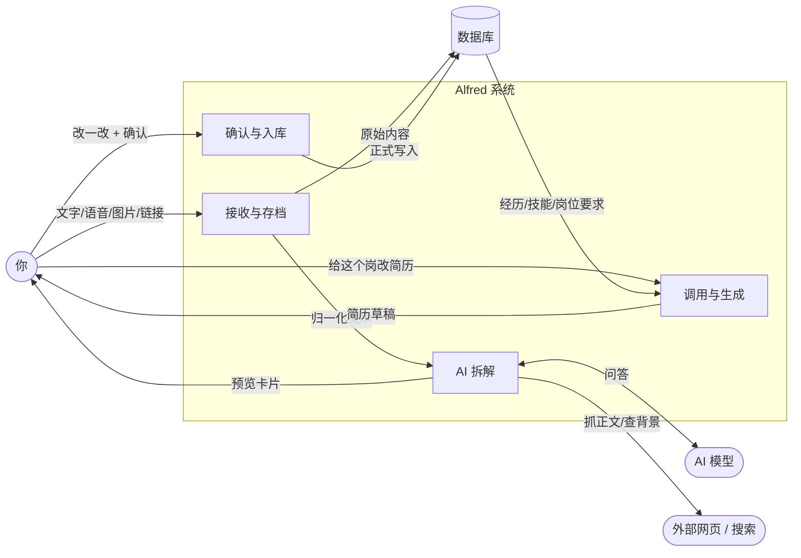

### 8.2 Level 1 —— 上传 JD 的内部数据流

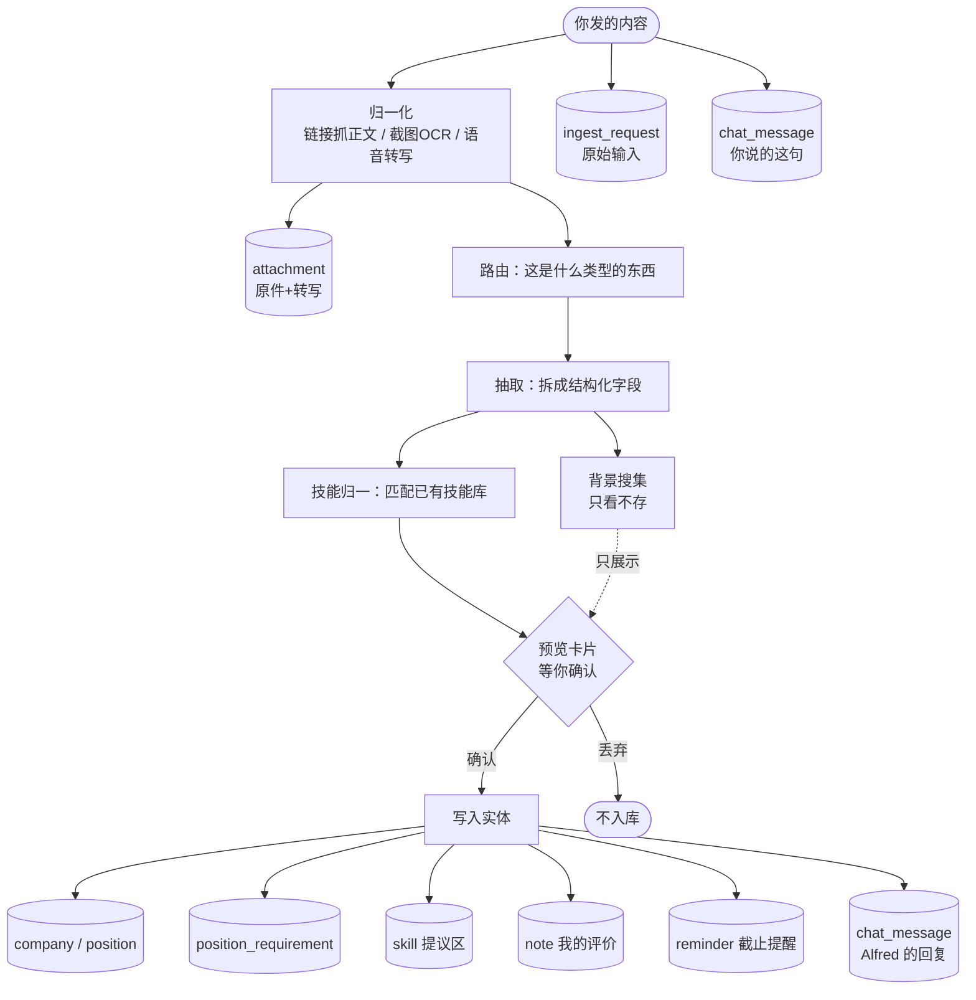

### 8.3 Level 1 —— 简历生成的数据流

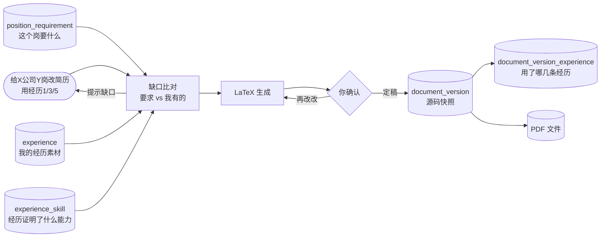

---

## 9. 流程图（Flow Diagram）

### 9.1 上传 JD 主流程

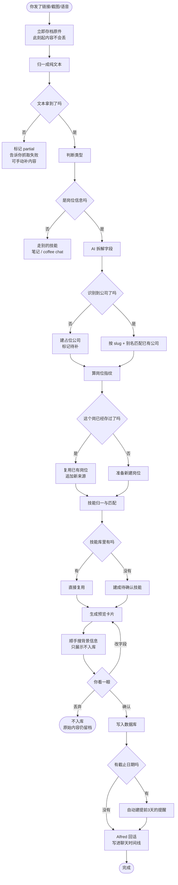

### 9.2 技能确认流程

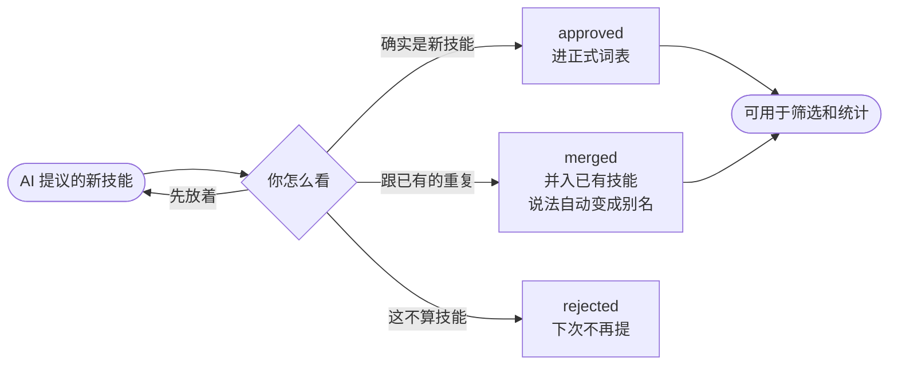

### 9.3 简历生成流程

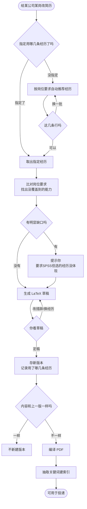

### 9.4 从上传到投递的完整闭环

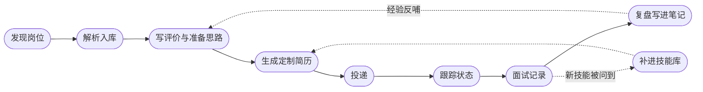

---

## 10. ER 图（实体关系）

### 10.1 上传与解析相关

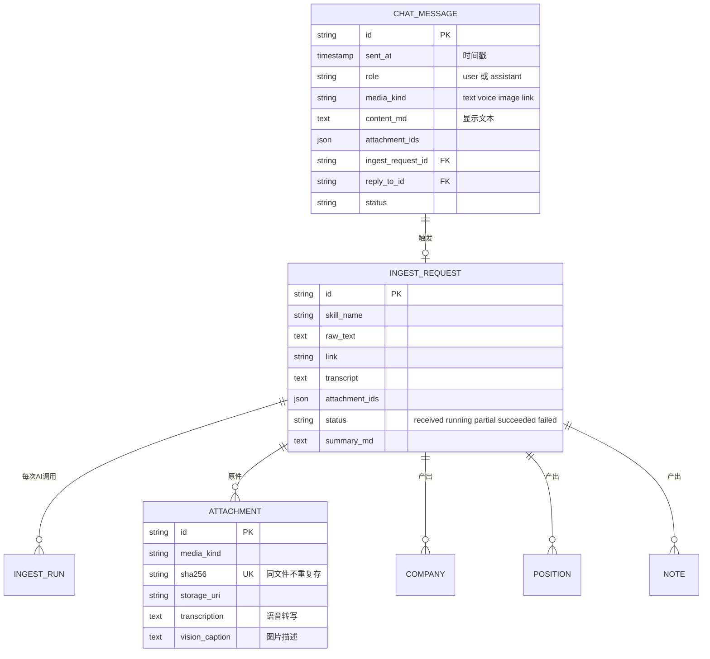

### 10.2 岗位 · 技能 · 要求

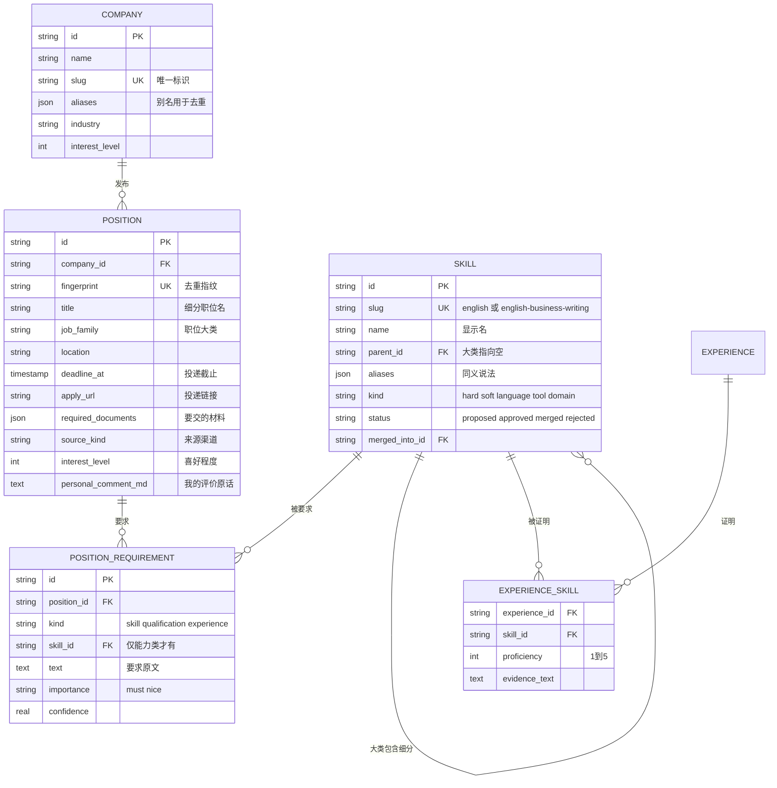

### 10.3 经历 · 文档 · 投递

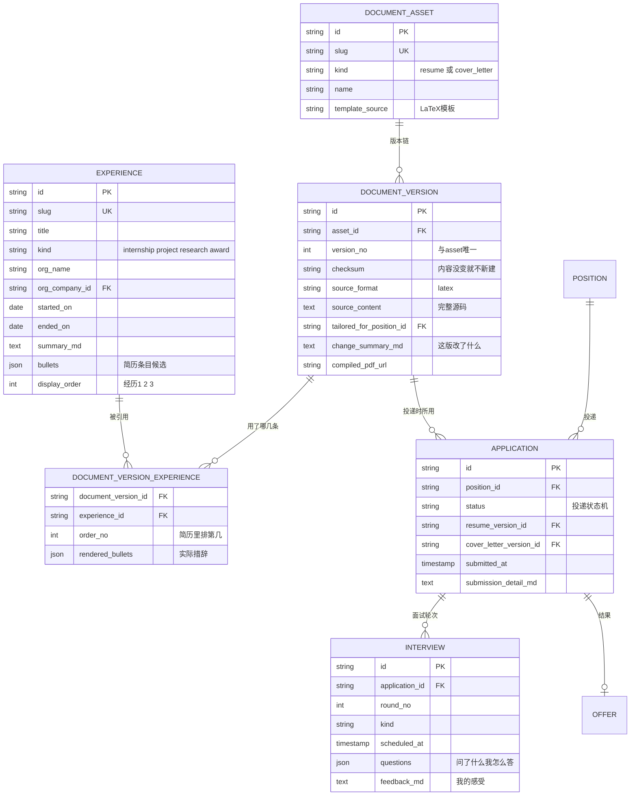

### 10.4 万能连线 `entity_link`

任何两个实体都能连起来，不用为每种关系加一张表。

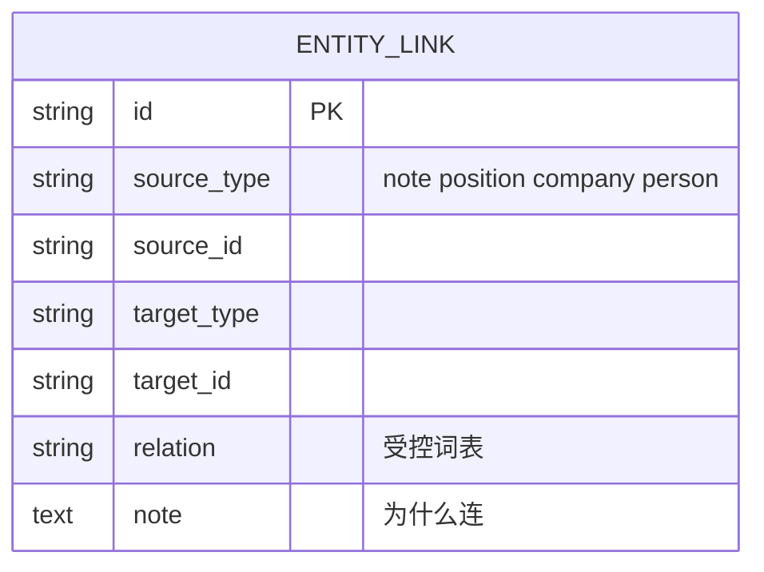

常用连法：

| 场景 | 连法 |
|---|---|
| 这条笔记是关于那个岗的 | `note → position`，relation = `about` |
| 这条笔记提到了某家公司 | `note → company`，relation = `mentions` |
| 这个岗需要某技能 | 走 `position_requirement` 专表，不用 entity_link |
| 这张截图是这次投递的凭证 | `application → attachment`，relation = `evidence` |
| 这条笔记来自那段录音 | `note → attachment`，relation = `derived_from` |

---

## 11. 潜在问题 Brainstorm（先踩坑）

### 高风险（不处理一定出事）

**① 技能库爆炸**
- 现象：三个月后技能表里有 400 条，其中 300 条是同义重复
- 对策：AI 只能提议不能直接入库；`proposed` 不参与筛选；提供"合并技能"操作，合并时旧说法自动进别名

**② 截图 / OCR 认错关键字段**
- 现象：公司名认成"字节眺动"，截止日期认成去年
- 对策：强制走预览卡片；AI 推算出来的字段（如"本周五"→ 具体日期）在卡片上**高亮标注**，提醒你重点检查

**③ 经历和笔记混为一谈**
- 现象：想往简历里加东西时，翻遍笔记也找不到那段实习怎么写的
- 对策：已定案分表。判断标准一句话——**能写进简历的是经历，其余全是笔记**

**④ 简历版本认不出来**
- 现象：收到面试通知，不知道当初投的是哪版
- 对策：`application.resume_version_id` 硬关联 + `document_version_experience` 记录用了哪几条经历 + 每版必填改动摘要

### 中风险（会不舒服但不致命）

**⑤ 同一岗位重复入库**
- 小红书发一次、LinkedIn 再发一次 → 指纹去重，但指纹依赖"标准化职位名"，"数据分析师"和"数据分析实习生"会被当成两个岗（这是对的）；而"Data Analyst"和"数据分析师"会被当成两个岗（这是错的）
- 对策：指纹先用中英归一表处理一遍；命中不确定时在预览卡片上问你"这是不是和已有的 XX 是同一个岗"

**⑥ 聊天时间线越滚越长**
- 对策：时间线按天分组、分页加载；给消息加 `is_pinned`，重要的能置顶；纯闲聊可以标记为可归档

**⑦ 你的评价被塞进 JD 描述里**
- 现象：AI 把"这家听说加班很凶"写进了 `position.description_md`
- 对策：prompt 里已明确"my_comment 只记录用户自己说的主观评价"；再加一条校验——描述字段里如果出现第一人称，打回重来

**⑧ 背景搜集的信息想留下来**
- 目前定的是不入库。但如果你搜到一条"这家去年裁员 30%"，肯定想留
- 对策：背景信息默认不存，但在卡片上给一个「存为笔记」按钮，你点了才存成 `note`（`kind=research`）

### 低风险（记着就行）

**⑨ 投递材料清单没人管** → `position.required_documents` + 生成 checklist 提醒
**⑩ 同一岗二次投递** → 不阻止，但提示"你 3 月投过这个岗"
**⑪ PDF 越存越多** → PDF 本身不大；真占地方的是截图，用 sha256 去重已能解决大半

---

## 12. 与现有代码的差距（实现清单）

### 12.1 要新建的表（5 张）

| 表 | 作用 | 优先级 |
|---|---|---|
| `skill` | 两级技能受控词表，带 proposed 状态 | P0 |
| `position_requirement` | 替代 `position.requirements` 这个 JSON 字段 | P0 |
| `experience` | 个人经历素材库 | P0 |
| `experience_skill` | 经历 ↔ 技能 | P1 |
| `document_version_experience` | 简历版本 ↔ 用了哪几条经历 | P1 |
| `chat_message` | 你和 Alfred 的双向时间线 | P1 |

### 12.2 要改的地方

| 位置 | 改什么 |
|---|---|
| `alfred/models/tables.py` | 加上述新表；`position` 增加 `required_documents`、`posted_at` |
| `alfred/models/enums.py` | 加 `SkillStatus`、`SkillKind`、`RequirementKind`、`ChatRole`、`ExperienceKind` |
| `alfred/skills/extract_job/skill.yaml` | 输出 schema 里 `skills` 从"字符串列表"升级为"带大类/证据句/强度的对象列表"；`requirements` 增加 `kind` 区分能力/学历/经历；`actions` 里的 `add_tags` 换成 `upsert_skills` + `link_requirements` |
| `alfred/skills/_actions.py` | 新增 `upsert_skill`（含归一化匹配）、`link_requirement`、`append_chat_message` |
| `alfred/ingest.py` | 支持 dry_run 预览模式；每次 ingest 前后写 `chat_message` |
| 接口层 | 新增：技能确认/合并、经历 CRUD、聊天时间线分页查询、预览确认提交 |

> 现有 `docs/DATA_MODEL.md` 里把技能表述为「`namespace='skill'` 的 tag」。本设计**取代**该方案：tag 是自由标签，扛不住"两级结构 + 提议确认 + 合并去重"这三件事。落地时需同步更新 DATA_MODEL.md。

### 12.3 建议的落地顺序

```
第 1 步  建 skill + position_requirement 表，改 extract_job 技能  ← 上传链路立刻变干净
第 2 步  加预览确认机制（dry_run + 确认接口）                     ← 挡住脏数据
第 3 步  建 experience 表 + 录入你现有的经历                      ← 为简历生成铺路
第 4 步  简历生成链路 + document_version_experience
第 5 步  chat_message 时间线
```

---

## 13. 还需要你后续拍板的开放问题

这几个不影响现在动工，但迟早要定：

1. **技能层级会不会不够用？** 现在是两级（大类 → 细分）。像"心理学 → 临床评估 → MMPI 量表施测"这种三级，暂时压成两级（大类=心理学，细分=MMPI 量表施测）。如果以后发现不够，`parent_id` 自引用天然支持多级，不用改表。
2. **技能要不要记"我的熟练度"？** 现在熟练度挂在 `experience_skill` 上（这段经历体现的水平）。要不要再有一个"我整体的 Excel 水平"？建议先不加，用经历自动推算。
3. **背景搜集完全不存，会不会后悔？** 已给了折中方案（默认不存 + 一键存为笔记）。
4. **Cover Letter 和 Personal Statement 要不要分开？** 现在 `document_asset.kind` 已经能区分，加一个枚举值即可。
5. **经历的"多语言措辞"存哪？** 现在放在 `experience.bullets` 里（一条经历可以有中英两套说法）。如果以后要做完整的中英双版简历，可能要单独拆。

---

*最后更新：2026-08-02*
