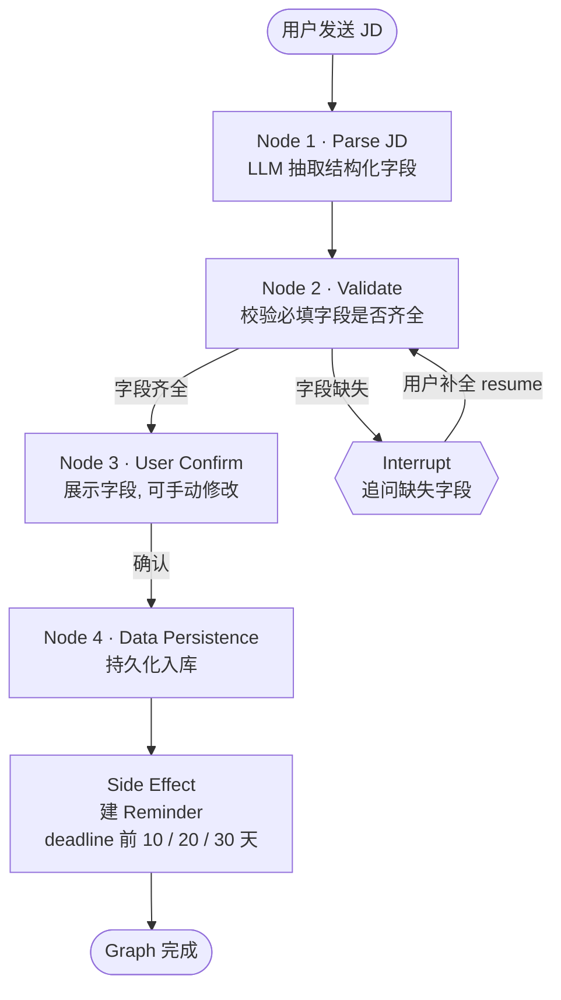

# 求职助理 · Graph 编排设计（Design Document）

> **元信息**
>
> - 状态：草稿（待评审，逐 Graph 补全）
> - 最后更新：2026-08-18
> - 范围：将 PRD 工作流翻译为引擎 Graph（编排 / 行为层）；本稿覆盖**工作流一～四**；**不涉及数据模型（ER 见 DATA_MODEL_V2 / V3）**
> - 关联：PRD 求职助理、ADR-0018（Node/Graph/Action）、ADR-0023（图表归档）、GLOSSARY

## 1. 目标与范围

把已评审的 PRD 工作流（你已看过首页 / VISION / 工作流一～四）翻译为引擎可执行的 **Graph 编排**。本设计只关心"Graph 怎么串、Node 做什么、何时 Interrupt、Side Effect 触发什么"，不重复数据模型（那部分在 DATA_MODEL_V2 / V3）。

**本次范围 = PRD 工作流一～四**（你已审的部分）。一个工作流**可拆成多个 Graph**，切分边界 = **独立触发事件**；Graph 1 已落地，工作流一预计还有 Graph 2（你稍后定义）。

图表归属遵循 [ADR-0023](../adr/0023-diagram-placement.md)：User Flow 在 PRD，Graph 内部的**状态机 / 活动图**落本 Design Document。

## 2. Graph 编排框架

### 2.1 术语对齐（复用 ADR-0018 / GLOSSARY，不新增原语）

| 你的说法 | 映射到 | 说明 |
|---|---|---|
| **Graph** | Graph（图） | 独立触发单元，有生命周期起点与终点（见 2.3）。 |
| **Node** | Node（节点） | 处理单元 = LLM 抽取 → `out` → 一组 Action。无控制流。 |
| **Conditional Edge** | 带条件的 Edge | `add_conditional_edges`，按 state 分支（齐全 / 缺失）。 |
| **Side Effect** | 一组 Action | Node 主逻辑完成后的**附加写操作**（如建 Reminder），不是新原语。 |
| **Interrupt** | LangGraph `interrupt` / `resume` | HITL 暂停：追问缺失字段 / 等用户确认，同源 thread `resume` 继续。见 GLOSSARY §D。 |

### 2.2 工作流（PRD）vs Graph（引擎）

- **PRD 工作流** = 用户视角的端到端流程（"做什么"）。
- **Graph** = 引擎编排单元（"怎么做"）。
- 一个工作流**可拆成多个 Graph**；切分边界 = **独立触发事件**（如"用户发 JD"触发 Graph 1，"用户发想法 / 后续事件"触发其它 Graph）。多个 Graph 共享同一引擎，但各自独立触发、各自有生命周期（见 2.3）。

### 2.3 Graph 生命周期

- **起点**：独立触发事件（如"用户发送 JD"）。
- **终点**：Graph 完成（如"信息持久化入库"）。
- **中途**：可经 Interrupt 暂停，等待用户本轮补全后 `resume`，同源 `thread_id` 继续，部分解析结果留在 `AlfredState`。

## 3. Graph 1 · JD 解析 + 确认 + 入库

- **触发**：用户发送 JD（链接 / 截图 / 语音 / 文字）。
- **终点**：字段持久化入库（及由此产生的 Reminder Side Effect）。
- **对应 PRD**：工作流一 step 1–5（解析 → 校验 → 确认 → 入库）。Step 6（想法与计划记录）不单列 Graph，作为 Side Effect 挂载（见 3.5）。

### 3.1 流程图（Design 归属：State Machine / Activity，见 ADR-0023）

> 说明：原描述里"字段齐全后直接展示确认"与 Node 3（User Confirm）是同一环节，已归一为 **Node 3 统一出口**；Reminder 作为 **Node 4 的 Side Effect 只触发一次**（避免 Edge 1(c) 与 Node 4 重复建提醒）。
> **Node 3 = 一次 HITL `interrupt`**：展示字段并等用户确认 / 修改，复用与 Node 2 缺失分支相同的 `interrupt()` / `resume()` 机制（同源 `thread_id`），确认信号（及可能修改过的字段）回写 state 后进入 Node 4。

### 3.2 Node 规格

| Node | 类型 | 输入 → 输出 | 关键 Action |
|---|---|---|---|
| **1 · Parse JD** | Declarative Node（`extract_job`） | 已归一为文本的 JD（链接抓取 / 截图 OCR / 语音 ASR 在 Graph **外**的接入层完成）→ 结构化 `job_posting` 字段（公司 / 岗位 / 城市 / 截止日期 / 要求 / 技能 / 投递方式；视频·CV·CL·PS 为按需可选） | 无（仅抽取） |
| **2 · Validate** | Scripted Node（纯逻辑，无 LLM） | 字段集 → 分支决策（齐全 / 缺失 + 缺哪些） | 无 |
| **3 · User Confirm** | HITL `interrupt`（渲染 + 收集） | 展示 `ui_intent = confirm_preview`，`interrupt()` 暂停等用户确认 / 修改；`resume()` 回写确认信号与（可能修改过的）字段到 state | 无（确认信号回写 state） |
| **4 · Data Persistence** | Scripted / Declarative Node | 最终字段 → 落库 | `upsert_job_posting`、`write_fact`（公司 / 岗位 / 城市 / deadline…）；随后 Side Effect |

### 3.3 Side Effect（Node 4 完成后）

- 若 JD 含 `deadline`，建 `reminder` 行（内核表，见 GLOSSARY §B）：提前 **10 / 20 / 30 天各一条（固定偏移，已拍板）**。
- 假设：单 JD 通常一个 deadline → 3 条；若解析出多个 deadline（罕见），按每个 deadline 各建 3 条（待评审，非阻塞）。
- 经 Action 写库，可 dry-run 预览（HITL，见 GLOSSARY §D）。

### 3.4 Interrupt 细节（字段缺失分支）

- `Node 2` 判缺失 → 发 `ui_intent` 追问缺字段 → `interrupt()` 暂停。
- 用户补全本轮消息 → `resume()` 回同一 Graph 实例（同源 `thread_id`），缺失字段并入 `AlfredState` → 回到 `Node 2` 再校验。
- 循环直至齐全，再走 `Node 3 → Node 4`。

### 3.5 Step 6（记录用户想法与计划）= Side Effect

PRD 工作流一 step 6（用户在对话中流露的想法 / 计划）**不单独建 Graph**，而是作为某个 Graph 的 **Side Effect**：在相关 Graph 完成主逻辑后，抽取对话中的想法 / 计划，写入 `job_thought`（求职领域包表）并可挂到对应公司 / 岗位，必要时派生 `reminder`。具体挂载到哪个 Graph（Graph 1 还是 Graph 2）待 Graph 2 定义后确定。

## 4. Open Questions（待拍板 / 待补）

> **已拍板**：① 范围 = 工作流一～四；② 一个工作流可拆多 Graph，边界 = 独立触发事件；③ Step 6 = Side Effect（非独立 Graph）；④ Reminder 固定 10/20/30 天；⑤ Parse JD = 纯 LLM 抽取（多模态归一在 Graph 外的接入层）；⑥ Node 3 User Confirm = 一次 HITL `interrupt`，复用与 Node 2 缺失分支相同机制。

1. **Graph 1 的 `AlfredState` 字段**：Parse JD 抽取结果如何落在 state（如 `state.job_posting` / `state.missing_fields` / `state.ui_intent`）？抽取 schema 与 DATA_MODEL 字段名如何对齐？
2. **Graph 2（工作流一第二部分）**：你稍后定义——它是什么触发、做什么、是否承载 Step 6 的 Side Effect？**（当前暂停点：等你讲完 Graph 2 再继续画工作流二～四）**
3. **工作流二～四 的 Graph 切分**：各自一个 Graph，还是继续细分？待 Graph 2 定义后一并推进。

## 5. 后续 Graph（占位）

- **Graph 2**：工作流一（第二部分，待你稍后说明）；可能承载 Step 6 想法记录的 Side Effect。
- **Graph 3 / 4 / 5**：对应 PRD 工作流二 / 三 / 四（scope 内，待补）。
- **Graph 6–N**：对应 PRD 工作流五～十五（待你审完 PRD 再补）。
