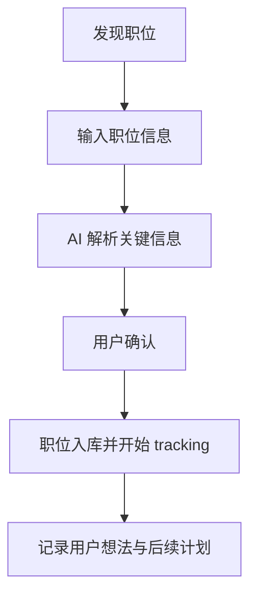
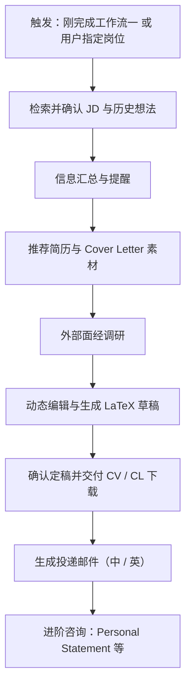
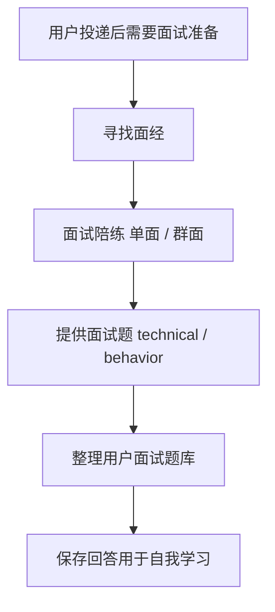
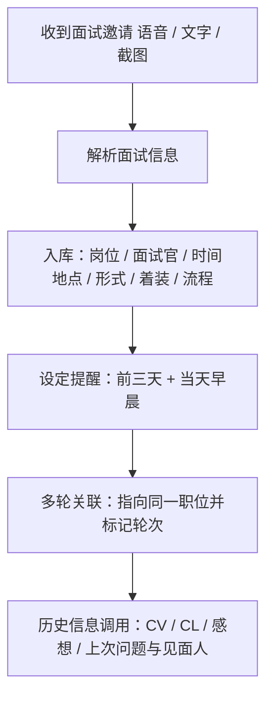

# 求职助理 · 用户流程与需求（PRD）

> **用途**：本 PRD 描述求职助理（V1 第一个产品路径）从用户视角的使用场景与功能需求，是 [VISION](../VISION.md) 中 V1 核心命题的产品级展开，后续催生 Design Document 与 ADR。
> 图表约定见 [ADR-0023 图表归档位置](../adr/0023-diagram-placement.md)：本篇归 User Flow / UX Flow（用户视角），AI 内部时序由 Design Document 的 Sequence Diagram 承接。

## 背景与目标

用户在多个渠道（邮件、官网、领英、社媒、口口相传）持续发现职位、整理信息、投递并跟进。痛点：信息碎片化、容易遗漏 deadline 与跟进动作、难以把「我有什么」与「岗位要什么」对齐。

目标：把散落在语音 / 截图 / 链接 / 文字里的求职信息，变成一张能查、能算、能提醒的关系网，并端到端 tracking 一次投递的完整生命周期（见 [VISION · 投递追踪](../VISION.md)）。

## 用户场景（User Flows）

### 工作流一：找到 JD 并上传 JD



1. **信息来源**：用户看到好职位，来源可能包括——
   - 邮件、公司官网、领英
   - 别人转发的消息、小红书、微信公众号
   - 朋友口头告知，或在其它地方看到并拍下的照片
2. **输入职位信息**：用户通过以下方式把职位信息交给 AI——
   - 公司官网链接、图片截图
   - 语音输入、复制的文字消息等
3. **解析职位信息（Processing）**：AI 收到后解析，至少提取——
   - 基本信息：公司、岗位类型、所在城市、截止日期
   - 岗位要求：Requirements、所需技能、是否需要特定证书
   - 投递要求：如何投递、是否需录制视频、是否需 CV / Cover Letter / Personal Statement 等
4. **用户确认与入库**：AI 解析出关键信息后，给用户确认；用户审核无误，职位正式入库并开始 tracking。
5. **记录用户想法与后续计划**：职位开始 tracking 后，用户可能围绕该职位产生想法，并通过语音 / 文字发给 AI。AI 解析并关联——
   - **简历与经历**：若提到想用什么简历或经历，AI 解析这些经历是否已存在；若是新经历，解析后跟用户确认是否入库。
   - **投递计划**：若提到想什么时候投递，AI 解析并设置一个日程提醒。
   - **感想与面经**：若提到对公司的理解、想法或别人的面经，入库时需与**该公司**挂钩；若是对岗位的想法，则与**该岗位**挂钩——以便未来用户需要时，能随时调出与该公司或岗位相关的所有信息。

> 用户说完想法后，工作流一基本结束。

### 工作流二：准备并投递岗位



1. **上下文继承与确认**：若紧接工作流一，系统自动继承该岗位上下文继续投递；否则用户需说明公司、岗位、城市等关键信息。系统检索并展示对应 JD 与用户此前围绕该岗位 / 公司的想法，与用户确认无误后再继续。
2. **信息汇总与提醒**：综合用户对该岗位的理解、对公司的评价、对城市的考量等，整理成一份总结，提醒用户："你要投递的岗位是这样的，你之前有这些想法。"
3. **简历与 Cover Letter 推荐**：
   (a) 依据 JD 要求的技能点（Skill Set），从用户经历库中筛选并推荐最匹配的条目，用于优化简历。
   (b) 若岗位需要 Cover Letter，同样推荐最匹配的经历素材。
4. **外部资源调研**：在小红书、互联网、微信公众号等渠道，搜索该公司与职位的面经或心得，整理后供用户参考。
5. **动态编辑与生成**：
   (a) 用户基于推荐内容筛选或口述修改，AI 动态调整简历与 Cover Letter 话术。
   (b) 确认无误后，生成 LaTeX 格式草稿模板供用户审阅。
   (c) 用户可继续口述修改或手动编辑，最终生成定稿。
6. **文件交付（CV / CL 命名规范）**：提供下载链接。文件命名须专业规范——**全英文 + 下划线连接**，并明确区分 `CV` 与 `CL`，例如 `姓名_CV.pdf`、`姓名_CL.pdf`；严禁使用"第一版""第二版"等字眼。
7. **投递邮件生成（多语料）**：部分岗位需用户发邮件投递。AI 按目标语言（中文 / 英文）生成投递邮件，引用对应的 CV 或 CL。邮件内容依赖语料库：同一段经历素材会被翻译成不同语言版本，但底层经历保持一致。邮件文件同样采用「英文 + 下划线」命名，并独立于 CV / CL 追踪其每个版本。

> **版本追踪说明**：CV、CL、邮件各自的"哪一份用在哪个岗位"映射，**不在生成时记录**，而是在工作流三（用户告知投递情况）中由用户确认后落库。

> 交付与邮件生成后，用户可能进一步咨询 Personal Statement 等进阶问题。此时 AI 以资深求职辅导者 / 资深 HR 的视角，结合用户经历与岗位认知，给出专业建议。

### 工作流三：用户告知投递情况

```mermaid
flowchart TD
  A[用户告知投递的岗位] --> B[确认所用 CV / CL / 邮件]
  B --> C[用户提供凭证：图片 / PDF / 语音 / 文字 或 "刚生成的那份"]
  C --> D[记录投递台账：状态 / 时间 / 方式 / 内容]
  D --> E[解析面经入库存档]
  E --> F[按需搜索该岗位面试时间 / 准备建议]
```

1. **告知投递岗位**：用户告知已投递的岗位（方式可能是官网投递、发消息或写邮件）。
2. **确认所用材料**：用户确认本次投递所用的简历（CV）、Cover Letter 及邮件内容——有时不需要邮件，或只发送了特定信息。
3. **凭证与识别**：用户可能通过图片、PDF、语音或文字提供投递凭证；即便不提供原文、只说"刚才生成的那一份"，AI 也需识别并定位到对应版本并记录。

据此为该岗位记录投递台账：
- **投递状态**：是否已投递。
- **投递时间**。
- **所用材料**：本次投递的 CV 与 CL 版本。
- **投递方式及内容**：邮件或聊天，以及具体内容。

**额外处理**：
- 若用户提到面经，解析后存入数据库，并与对应岗位 / 公司挂钩。
- 对特定岗位，可主动搜索相关信息（如预计收到第一轮面试的时间、准备建议等）告知用户；**搜不到时如实说明，绝不编造数据**。

### 工作流四：面试准备（模拟面试）



1. **寻找面经**：用户可能询问是否有相关面经，AI 帮用户搜寻；没有也没关系，但**绝不瞎编**。
2. **面试陪练（单面 / 群面）**：
   (a) **语音交互与评判**：目前尚不确定 Alfred 是否具备原生语音能力；若没有，可引导用户通过语音输入表达。AI 以面试官视角评判：哪里说得好、哪里说得不好、哪里可改进。
   (b) **记录与自我学习**：用户回答内容均可保存，作为未来经历积累或对用户的个性化提示，便于自我学习。
3. **提供面试题**：
   (a) 针对 technical（技术面）或 behavior（行为面），都可提供对应面试题。
   (b) **免责提示**：AI 生成的题目必然不够全面，必须再三向用户强调——这仅为 AI 生成内容，用户自身也应另行搜寻补充。
4. **整理面试题库**：若用户自行搜到优质面经或面试题，AI 帮其整理为结构化面试题库（含 technical / behavior / 单面 / 群面等类型），便于日后训练。

### 工作流五：面试信息追踪（Interview Tracking）



1. **信息解析与入库**：用户收到面试邀请邮件后，可能通过语音、文字或截图告知。AI 解析并存入数据库，至少提取：
   - 岗位与公司
   - 发邮件的人、面试官是谁
   - 面试时间与地点
   - 面试形式（单面 / 群面）
   - 着装要求
   - 面试流程与时长
2. **自动设定提醒**：在面试前三天提醒一次，在面试当天早晨再提醒一次。
3. **面试 tracking（多轮关联）**：
   (a) 记录这是第几轮面试（如第一轮、第二轮、HR 面）。
   (b) 若此前无面试，则本次为第一次；若此前已有面试，需将这些面试经历连在一起，确保指向同一个职位，并理清是第几轮。
4. **历史信息调用**：若面试轮次很多，用户可通过对话调取——最初投递用的哪份 CV、哪份 CL、最近对该职位有什么感想、上次面试问了什么问题、上次跟谁见面等。只要用户需要，这些信息都应能调用出来。

## 功能需求

- **FR-1 多渠道采集**：接受链接、截图、语音、粘贴文字等多种输入模态。
- **FR-2 JD 解析**：从任意输入提取基本信息 / 岗位要求 / 投递要求三类结构化字段。
- **FR-3 入库前确认**：解析结果先呈现给用户确认，确认后才落库并开始 tracking。
- **FR-4 想法关联**：用户针对某职位的语音 / 文字想法，自动关联到对应公司或岗位；涉及新经历时触发确认入库；涉及投递时间时生成日程提醒。
- **FR-5 投递生命周期 tracking**：覆盖投递时间 / deadline / 面试 / offer 等节点（详见工作流二与 [VISION · 投递追踪](../VISION.md)）。
- **FR-6 投递准备与生成**：继承上下文并确认 JD 与历史想法；按 JD 技能点推荐简历 / Cover Letter 素材；外部面经调研；LaTeX 动态生成与专业命名交付；进阶咨询以资深求职辅导者视角作答。
- **FR-7 投递邮件生成与多语料**：用户需发邮件时，按目标语言（中 / 英）生成邮件并引用对应 CV / CL；同一经历按语言翻译为不同版本，底层经历保持一致；邮件文件独立命名与版本追踪。
- **FR-8 投递台账与状态记录**：在用户确认后记录岗位投递状态（已投递 / 时间 / 方式 / 内容）及所用 CV / CL / 邮件版本映射；解析并存储面经；按需搜索岗位面试相关信息，搜不到如实说明。
- **FR-9 面试准备与陪练**：协助寻找面经（搜不到如实说明不编造）；以面试官视角对单面 / 群面回答做评判与改进建议；保存用户回答用于经历积累与自我学习。
- **FR-10 面试题库整理**：提供 technical / behavior 面试题并强调查漏补缺需用户自行补充；将用户搜到的优质面经 / 题整理为分类题库（technical / behavior / 单面 / 群面）。
- **FR-11 面试信息解析与入库**：从语音 / 文字 / 截图解析面试邀请并入库（岗位 / 公司、发件人与面试官、时间地点、形式、着装、流程时长）。
- **FR-12 面试提醒与多轮关联**：面试前三天与当天早晨双提醒；按职位串联多轮面试并标记轮次；支持对话式调取历史投递材料与往轮面试信息。

## 非功能需求

- **NFR-1 可溯源**：每条入库信息都能回答「你凭什么这么说」（关联原始输入）。
- **NFR-2 多模态优先**：输入门槛越低越好（语音 / 图片 / 文字均可）。
- **NFR-3 不代替判断**：投递决策由人做，AI 只降低摩擦。

## 成功指标

- 用户能在一次对话内完成「发现 → 上传 → 确认 → 开始 tracking」。
- 围绕职位的想法能被正确挂到公司 / 岗位，且可检索。
- 每个岗位能明确确认使用了哪一份 CV / CL / 邮件（版本可追溯）。
- 用户能围绕目标岗位完成模拟面试，并沉淀可复用的面试题库与回答记录。
- 多轮面试能按职位串联并标记轮次，用户可随时对话调取任一历史节点信息。

## 范围（In / Out）

- **In**：求职路径的 JD 采集、解析、入库、想法关联、投递 tracking。
- **Out（本轮）**：CRM / 记账 / 健康等 V2–V4 领域（仅保留扩展能力，见 [VISION](../VISION.md)）。

## 关联 Design

- 数据模型与解析落点：Design Document（ER / Sequence Diagram）。
- 领域无关内核约束：[ADR-0016](../adr/0016-domain-agnostic-kernel.md)。
- 投递生命周期的状态机 / 时序：后续 Design Document（State Machine / Sequence Diagram）。
- 投递台账与 CV / CL / 邮件版本映射：后续 Design Document（ER / State Machine）。
- 面试生命周期与多轮状态机：后续 Design Document（State Machine / Sequence Diagram）。
